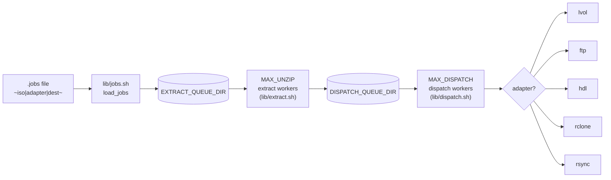

# loadout-pipeline

A lightweight shell-based pipeline for **unpacking ISO/game files** and dispatching them to multiple destinations (FTP, HDL dump, local volume, rclone, rsync).

It supports **parallel extraction**, **bounded queues**, **pluggable adapters**, **flock-guarded space reservations**, and **intra-run recovery of SIGKILL'd workers** — designed for fast scratch storage and large archival pools.

---

## Overview



---

## Features

- Two-stage pipeline: extract workers (`MAX_UNZIP`) and dispatch workers (`MAX_DISPATCH`) drain two file-based queues concurrently so dispatch of job N overlaps extraction of job N+1
- Dispatch to multiple destinations: FTP, HDL dump, local volume (SD cards, USB drives, NVMe/SSD/HDD), rclone, rsync
- Precheck short-circuit: skips the whole copy → extract → dispatch sequence when the contents are already present at the destination (`[skip] ...`)
- **Shared space ledger** (`lib/space.sh`): concurrent extract workers coordinate scratch-space reservations through a `flock`-guarded check-and-commit, with pooling on same-filesystem setups and a configurable overhead margin (`SPACE_OVERHEAD_PCT`, default 20%)
- **Per-run scratch spool** (`COPY_SPOOL=$COPY_DIR/$$`): each run owns its own subdir; a startup sweep reclaims spools left by previous runs whose PID is no longer alive — safe against concurrent pipeline instances
- **Intra-run recovery**: a worker registry (`lib/worker_registry.sh`) tracks in-flight jobs so a SIGKILL'd extract can be detected, re-queued, and finished on the next pass, up to `MAX_RECOVERY_ATTEMPTS`
- Race-safe file-based job queues (atomic `mv` claiming — no double-processing)
- Modular, pluggable adapters
- `.env` file support for environment configuration

---

## Quickstart

A **jobs file** is a plain text file with one job per line — it tells the pipeline which archives to process and where to send them. A **profile** is a directory on disk that holds one or more jobs files, so you can group related jobs (e.g. a shared `base.jobs` plus per-user `alice.jobs` / `bob.jobs`) and pick whichever set you need. The pipeline accepts either a single jobs file **or** a profile directory as its argument — passing a profile loads every `*.jobs` file inside it.

```bash
# 1. One-time setup
git clone <repo_url> && cd loadout-pipeline
cp .env.example .env
chmod 600 .env          # keep credentials private
bash test/fixtures/create_fixtures.sh   # generate test archives

# 2. Run a built-in example profile
bash bin/loadout-pipeline.sh examples/lvol.jobs

# 3. Run your own profile from anywhere on disk
bash bin/loadout-pipeline.sh ~/profiles/my_collection.jobs

# 4. Override the local volume destination at call time — no file editing needed
LVOL_MOUNT_POINT=/media/usbstick bash bin/loadout-pipeline.sh ~/profiles/my_collection.jobs

# 5. More workers + dedicated scratch dir for a fast NVMe drive
MAX_UNZIP=6 SCRATCH_DISK_DIR=/mnt/nvme \
    bash bin/loadout-pipeline.sh ~/profiles/my_collection.jobs
```

The first argument to `loadout-pipeline.sh` is the path to a **jobs file** or a **profile directory**. If no argument is given, `examples/example.jobs` is used as the default.

---

## Deployment

`loadout-pipeline` is designed to be deployed and run **three different ways**, and all three are treated as first-class:

1. **Git checkout** — run directly out of the repo root (`bash bin/loadout-pipeline.sh …`).
2. **Single bundled `.sh` file** — one self-contained script dropped onto a host (e.g. `/usr/local/bin/`) and optionally wired into `systemd` (or the equivalent on non-systemd distros).
3. **Docker image** — built from the included `Dockerfile`, with archives, profiles, and credentials supplied at runtime.

Every documented feature, env var, and CLI invocation works identically across all three. The test suite (`test/run_tests.sh` unit tests + `test/integration/run_integration.sh` integration tests + `test/validate_tests.sh` mutation validations) is run against the git-checkout layout **and** the bundled `dist/loadout-pipeline.sh` **and** the Docker image — a release is only cut when all three are green. None of the three modes is a "preferred" mode; pick whichever fits the host.

### Supported operating systems

The pipeline is pure POSIX shell + Bash 4+ and depends only on widely-available packages, so it runs on any modern Linux distribution and on macOS. Tested / compatible:

- **Debian** 11, 12 and derivatives
- **Ubuntu** 20.04, 22.04, 24.04 and derivatives (Linux Mint, Pop!_OS, Kubuntu, …)
- **Fedora** 38+ and **RHEL / CentOS Stream / Rocky / AlmaLinux** 8+
- **Arch Linux** / **Manjaro** / **EndeavourOS** (rolling)
- **openSUSE** Leap 15.5+ / Tumbleweed
- **Alpine Linux** 3.18+ (install the `bash` package — the default shell is `ash`)
- **Void Linux**, **Gentoo**
- **FreeBSD** 13+ (via `bash` + GNU coreutils from ports)
- **macOS** 12+ (via Homebrew — see note below on Bash version)
- **Windows** via **WSL2** running any of the above distros
- The official **Docker image** (`debian:stable-slim` base) works anywhere Docker / Podman runs, including Windows and macOS hosts

> macOS ships Bash 3.2; install Bash 4+ (`brew install bash`) and GNU coreutils (`brew install coreutils findutils gnu-sed`) before running natively. The Docker image is the friction-free path on macOS.

### Required packages

All three deployment modes need the same runtime dependencies. The Docker image bakes them in; for git-checkout and single-file deployments install them yourself.

**Core (always required):**

- `bash` (>= 4.0)
- `coreutils` — `stat`, `realpath`, `install`, `df`, `du`, `mv`, `cp`
- `findutils` — `find`, `xargs`
- `procps` / `procps-ng` — `ps`, `kill` (worker-registry PID tracking)
- `util-linux` — `flock` (atomic space ledger), `losetup`
- `p7zip-full` (Debian/Ubuntu) / `p7zip-plugins` (Fedora/RHEL) / `p7zip` (Arch, Alpine) — provides `7z x` and `7z l`

**Per-adapter (install only what you dispatch to):**

- `rsync` — used by the **lvol** adapter and the **rsync** adapter
- `rclone` — used by the **rclone** adapter
- `openssh-client` / `openssh` — used by the **rsync** adapter when targeting rsync-over-SSH
- `ca-certificates` — used by **rclone** for TLS
- `hdl_dump` — used by the **hdl_dump** adapter (build from source; not packaged on most distros)
- An FTP client (`curl`, `lftp`, or `ftp`) — used by the **ftp** adapter

**Install recipes:**

```bash
# Debian / Ubuntu / Mint / Pop!_OS
sudo apt-get update && sudo apt-get install -y \
    bash coreutils findutils procps util-linux \
    p7zip-full rsync rclone openssh-client ca-certificates

# Fedora / RHEL / Rocky / AlmaLinux
sudo dnf install -y \
    bash coreutils findutils procps-ng util-linux \
    p7zip p7zip-plugins rsync rclone openssh-clients ca-certificates

# Arch / Manjaro / EndeavourOS
sudo pacman -S --needed \
    bash coreutils findutils procps-ng util-linux \
    p7zip rsync rclone openssh ca-certificates

# openSUSE
sudo zypper install \
    bash coreutils findutils procps util-linux \
    p7zip-full rsync rclone openssh ca-certificates

# Alpine
sudo apk add \
    bash coreutils findutils procps util-linux \
    p7zip rsync rclone openssh-client ca-certificates

# macOS (Homebrew)
brew install bash coreutils findutils p7zip rsync rclone
```

---

### 1. Git-repo deployment

Clone the repo and run directly from its root — the most convenient mode for development, testing, and hosts where you want updates via `git pull`.

```bash
git clone <repo_url>
cd loadout-pipeline
chmod +x bin/loadout-pipeline.sh lib/extract.sh lib/dispatch.sh lib/precheck.sh adapters/*.sh \
         test/run_tests.sh test/validate_tests.sh test/fixtures/create_fixtures.sh \
         test/integration/launch.sh test/integration/run_integration.sh \
         test/integration/fixtures/generate_int_archives.sh
# lib/*.sh files are sourced (not executed directly) and do not need chmod +x
cp .env.example .env
chmod 600 .env

# Verify the install
bash test/run_tests.sh

# Run the pipeline
bash bin/loadout-pipeline.sh examples/lvol.jobs
```

The repo root is the working directory — `bin/loadout-pipeline.sh` discovers `lib/`, `adapters/`, `.env`, and `strip.list` relative to its own location, so you can invoke it from anywhere as long as the tree is intact.

### 2. Single-file `.sh` deployment

For servers where you don't want a git checkout (minimal appliances, embedded NAS boxes, immutable hosts) the whole pipeline can be bundled into **one** self-contained shell script:

```bash
bash build/bundle.sh
# → dist/loadout-pipeline.sh  (executable, ~1200 lines, ~44 KB)
scp dist/loadout-pipeline.sh user@host:/usr/local/bin/loadout-pipeline
```

The bundle concatenates `lib/`, `adapters/`, and `bin/loadout-pipeline.sh` into one file, minified (comments and blank lines stripped — no identifier mangling), and embeds `strip.list` inline. It uses a BusyBox-style multi-call pattern: the stages that must fork as real subprocesses (`extract`, `dispatch`, `precheck`, and the five adapters) re-invoke the bundle itself with an internal sentinel argument, so worker-registry PID tracking, orphan recovery, and SIGKILL handling are preserved bit-for-bit against the source tree. Usage is identical to `bin/loadout-pipeline.sh`; every documented env var works unchanged. `dist/` is gitignored — regenerate on demand.

#### Installing on `PATH` (call `loadout-pipeline` from any directory)

Dropping the bundled script into a directory that's already on the system `PATH` lets you invoke it as a plain command from any working directory — no `bash /full/path/to/...` required.

```bash
# System-wide (requires root) — available to every user
sudo install -m 0755 dist/loadout-pipeline.sh /usr/local/bin/loadout-pipeline

# Per-user — no root needed
install -m 0755 dist/loadout-pipeline.sh "$HOME/.local/bin/loadout-pipeline"
# Ensure ~/.local/bin is on PATH (bash/zsh):
#   echo 'export PATH="$HOME/.local/bin:$PATH"' >> ~/.bashrc && source ~/.bashrc

# Verify
which loadout-pipeline
loadout-pipeline ~/profiles/my_collection.jobs
```

`/usr/local/bin` is the conventional location for locally-installed executables on every mainstream distro and macOS; it's on root's and users' default `PATH` out of the box. `~/.local/bin` is the XDG per-user equivalent — on Debian 11+, Ubuntu 22.04+, Fedora, and Arch it's auto-added to `PATH` by the default login shell profile, but older distros and minimal images may need the manual `export` above.

**Note the filename drops the `.sh` extension** — it's conventional for installed commands (`ls`, not `ls.sh`), and the script works either way since it's invoked by its shebang, not its suffix.

##### Pitfalls and gotchas

- **`.env` is no longer next to the script.** In git-checkout mode `loadout-pipeline.sh` finds `.env` relative to its own location. Once the bundle lives in `/usr/local/bin`, you almost certainly **don't** want it reading `/usr/local/bin/.env` (and shouldn't put credentials there anyway). Put your `.env` somewhere sane (`/etc/loadout-pipeline/.env` system-wide, or `~/.config/loadout-pipeline/.env` per-user), `chmod 600` it, and either `source` it in your shell before invoking or point at it explicitly — every variable documented in `.env.example` can also be set inline: `LVOL_MOUNT_POINT=/mnt/sd MAX_UNZIP=4 loadout-pipeline my.jobs`.
- **Relative jobs-file paths are resolved against `$PWD`**, not the install location. `loadout-pipeline my.jobs` means "`./my.jobs` in whatever directory I'm currently `cd`'d into." Use absolute paths (`/etc/loadout-pipeline/jobs/my.jobs`) in cron / systemd / scripts where `$PWD` is unpredictable.
- **Scratch directories default to `/tmp`.** `SCRATCH_DISK_DIR` defaults to `/tmp`, and `QUEUE_DIR`, `EXTRACT_DIR`, and `COPY_DIR` all derive from it. On most distros `/tmp` is either small, `tmpfs`-backed (RAM!), or wiped on reboot. For real workloads set `SCRATCH_DISK_DIR` to a roomy disk — e.g. `SCRATCH_DISK_DIR=/var/lib/loadout-pipeline`. You can still override individual child dirs if needed.
- **Per-user `/tmp` collisions.** If two different users both run `loadout-pipeline` with default settings they'll collide in `/tmp/iso_pipeline_queue` and `/tmp/iso_pipeline_copies`. The per-run `$COPY_DIR/$$` spool isolates *runs*, not *users* — give each user their own `SCRATCH_DISK_DIR`, or run as a dedicated `loadout` service user.
- **SUID / capabilities do not propagate through the shebang.** Don't try to `chmod u+s` the script to let unprivileged users write to root-owned mount points — Linux ignores setuid on interpreted scripts. Use group permissions on the mount point, or run via `sudo` / a service unit.
- **`PATH` hijacking.** If the system also has `/usr/local/bin` **earlier** in `PATH` than a distro-packaged binary of the same name, you can shadow things unintentionally. `loadout-pipeline` isn't a name used by any known package, so this is theoretical — but if you ever rename the installed command, check `type -a <name>` first.
- **Upgrades don't happen automatically.** Unlike the git-checkout mode (`git pull`) or the Docker image (`docker pull`), a copied `.sh` file is frozen at the moment you installed it. Re-run `bash build/bundle.sh && sudo install -m 0755 dist/loadout-pipeline.sh /usr/local/bin/loadout-pipeline` after each update, or wrap it in a small `Makefile` / shell function so you don't forget.
- **Noexec mount points.** Some hardened systems mount `/tmp`, `/home`, or `/usr/local` with `noexec`. Check `mount | grep noexec` if you get `Permission denied` on an otherwise-executable script; install to a partition without the flag (usually `/usr/local/bin` is fine, `~/.local/bin` under a `noexec` home is not).
- **Shell completions / man pages are not installed.** The bundle is just the executable. If you want tab-completion or `man loadout-pipeline` you'll have to write them yourself — they're not generated by the build.

#### Running as a service

The single-file mode is the intended input for service-manager deployment. Examples below cover the major init systems — pick the one your distro uses.

**systemd** (Debian / Ubuntu / Fedora / RHEL / Rocky / AlmaLinux / Arch / openSUSE / most mainstream distros)

```ini
# /etc/systemd/system/loadout-pipeline.service
[Unit]
Description=Loadout pipeline — ISO unpack & dispatch
After=network-online.target local-fs.target
Wants=network-online.target

[Service]
Type=oneshot
EnvironmentFile=/etc/loadout-pipeline/.env
ExecStart=/usr/local/bin/loadout-pipeline /etc/loadout-pipeline/jobs/my_collection.jobs
User=loadout
Group=loadout
Nice=10
IOSchedulingClass=best-effort

[Install]
WantedBy=multi-user.target
```

```bash
sudo install -m 0755 dist/loadout-pipeline.sh /usr/local/bin/loadout-pipeline
sudo install -d -m 0755 /etc/loadout-pipeline /etc/loadout-pipeline/jobs
sudo install -m 0600 .env.example /etc/loadout-pipeline/.env   # then edit
sudo systemctl daemon-reload
sudo systemctl enable --now loadout-pipeline.service
```

Pair with a `loadout-pipeline.timer` unit for scheduled runs.

**OpenRC** (Alpine, Gentoo, Artix)

```sh
# /etc/init.d/loadout-pipeline
#!/sbin/openrc-run
name="loadout-pipeline"
command="/usr/local/bin/loadout-pipeline"
command_args="/etc/loadout-pipeline/jobs/my_collection.jobs"
command_user="loadout:loadout"
command_background=false
depend() { need net localmount; }
```

Install with `sudo rc-update add loadout-pipeline default` and trigger with `sudo rc-service loadout-pipeline start`.

**runit** (Void Linux, Artix-runit)

```sh
# /etc/sv/loadout-pipeline/run
#!/bin/sh
exec chpst -u loadout:loadout \
    /usr/local/bin/loadout-pipeline /etc/loadout-pipeline/jobs/my_collection.jobs
```

`sudo ln -s /etc/sv/loadout-pipeline /var/service/`

**s6 / s6-rc** (Alpine with s6-overlay, Obarun) — drop an equivalent `run` script under `/etc/s6/sv/loadout-pipeline/`.

**launchd** (macOS native) — place a plist at `/Library/LaunchDaemons/com.loadout.pipeline.plist` with `ProgramArguments` pointing at `/usr/local/bin/loadout-pipeline` and your jobs file.

**cron** (works on every Unix) — for a cheap scheduled run without an init unit:

```cron
# /etc/cron.d/loadout-pipeline
0 3 * * *  loadout  /usr/local/bin/loadout-pipeline /etc/loadout-pipeline/jobs/my_collection.jobs
```

### 3. Docker image deployment

For hosts that already run containers — or as the zero-friction option on macOS / Windows — the included `Dockerfile` produces a production image with every runtime dependency baked in.

```bash
docker build -t loadout-pipeline .

docker run --rm \
    -v /path/to/isos:/isos:ro \
    -v /path/to/profiles:/jobs:ro \
    -v /mnt/lvol:/mnt/lvol \
    -v /path/to/.env:/opt/loadout-pipeline/.env:ro \
    -e LVOL_MOUNT_POINT=/mnt/lvol \
    loadout-pipeline /jobs/my_games.jobs
```

Nothing user-specific is baked into the image — archives, job profiles, and adapter credentials are all supplied at runtime via bind-mounts and environment variables. The documented env-var priority order (inline `-e` > `.env` > defaults) is preserved. See the header comment in `Dockerfile` for the full conventional mount layout (`/isos`, `/jobs`, `/mnt/lvol`, `/tmp` for scratch). Podman works as a drop-in replacement for `docker` on Fedora / RHEL.

### Parity guarantee

The three modes are not alternative implementations — they are three packagings of the exact same source tree. The single-file bundler is deterministic and byte-for-byte reproducible; the Docker image copies the tree verbatim. The same `test/run_tests.sh`, `test/integration/run_integration.sh`, and `test/validate_tests.sh` suites run against each mode in CI, and each mode is expected to produce identical results for identical inputs. If you find behavior that differs between git-checkout, `dist/loadout-pipeline.sh`, and the Docker image, **that is a bug** — please file an issue.

---

## Configuration

Configuration is loaded from `.env` at startup. Copy `.env.example` to get started:

```bash
cp .env.example .env
```

All available variables (see `.env.example` for the full annotated reference):

**Pipeline core**

| Variable                          | Default                                 | Description                                                                                                                        |
| --------------------------------- | --------------------------------------- | ---------------------------------------------------------------------------------------------------------------------------------- |
| `DEBUG_IND`                       | `0`                                     | Logging verbosity: `0` silent, `1` debug, `2` extended. See [Debug output](#debug-output).                                         |
| `RESUME_PLANNER_IND`              | `0`                                     | Set to `1` to generate a resume plan on each run (cold-restart fast-path)                                                          |
| `MAX_UNZIP`                       | `2`                                     | Number of parallel extract-stage workers                                                                                           |
| `MAX_DISPATCH`                    | `2`                                     | Number of parallel dispatch-stage workers                                                                                          |
| `SCRATCH_DISK_DIR`                | `/tmp`                                  | Root for all scratch I/O; `EXTRACT_DIR`, `COPY_DIR`, and `QUEUE_DIR` derive from this                                              |
| `QUEUE_DIR`                       | `$SCRATCH_DISK_DIR/iso_pipeline_queue`  | Parent directory that holds the two sub-queues, space ledger, and worker registry                                                  |
| `EXTRACT_QUEUE_DIR`               | `$QUEUE_DIR/extract`                    | Sub-queue of archives waiting to be copied and extracted                                                                           |
| `DISPATCH_QUEUE_DIR`              | `$QUEUE_DIR/dispatch`                   | Sub-queue of extracted directories waiting to be handed to an adapter                                                              |
| `EXTRACT_DIR`                     | `$SCRATCH_DISK_DIR/iso_pipeline`        | Directory where archives are extracted during processing                                                                           |
| `COPY_DIR`                        | `$SCRATCH_DISK_DIR/iso_pipeline_copies` | Parent of the per-run scratch spool; each run claims `$COPY_DIR/$$`                                                                |
| `SPACE_OVERHEAD_PCT`              | `20`                                    | Percent overhead added to raw byte requirement in space reservations                                                               |
| `MAX_RECOVERY_ATTEMPTS`           | `3`                                     | Max intra-run recovery passes after SIGKILL'd worker(s) are detected                                                               |
| `EXTRACT_STRIP_LIST`              | `$ROOT_DIR/strip.list`                  | Strip-list file — members to delete pre-dispatch. See [Post-extraction strip list](#post-extraction-strip-list). Empty = disabled. |
| `DISPATCH_POLL_INITIAL_MS`        | `50`                                    | Starting poll interval (milliseconds) for dispatch workers when the dispatch queue is empty                                        |
| `DISPATCH_POLL_MAX_MS`            | `500`                                   | Maximum poll interval (milliseconds) for the exponential dispatch backoff                                                          |
| `SPACE_RETRY_BACKOFF_INITIAL_SEC` | `5`                                     | Initial sleep (seconds) for an extract worker after a space-reservation miss                                                       |
| `SPACE_RETRY_BACKOFF_MAX_SEC`     | `60`                                    | Maximum sleep (seconds) for the exponential space-retry backoff                                                                    |

**Local volume adapter** (`adapters/lvol.sh`) — **implemented**

| Variable           | Default     | Description                                          |
| ------------------ | ----------- | ---------------------------------------------------- |
| `LVOL_MOUNT_POINT` | `/mnt/lvol` | Root destination directory (any writable local path) |

**FTP adapter** (`adapters/ftp.sh`) — stub

| Variable   | Default | Description         |
| ---------- | ------- | ------------------- |
| `FTP_HOST` |         | FTP server hostname |
| `FTP_USER` |         | FTP username        |
| `FTP_PASS` |         | FTP password        |
| `FTP_PORT` | `21`    | FTP port            |

**HDL dump adapter** (`adapters/hdl_dump.sh`)

| Variable             | Default    | Description                                                               |
| -------------------- | ---------- | ------------------------------------------------------------------------- |
| `HDL_DUMP_BIN`       | `hdl_dump` | Path to the `hdl_dump` binary                                             |
| `HDL_HOST_DEVICE`    |            | Device id used for a startup writability probe (e.g. `sri:`); empty skips |
| `HDL_INSTALL_TARGET` |            | `hdl_dump` target for every inject (e.g. `hdd0:`); required for hdl jobs  |

Per-job fields (disc format and PS2 title) come from the `.jobs` line — see the Jobs file format section for the 4-field hdl syntax. `hdl_dump` resolves `HDL_INSTALL_TARGET` via the operator's own `~/.hdl_dump.conf`; the adapter does not rewrite `HOME` or fabricate a scratch config.

**rclone adapter** (`adapters/rclone.sh`) — stub

| Variable           | Default | Description                                                   |
| ------------------ | ------- | ------------------------------------------------------------- |
| `RCLONE_REMOTE`    |         | Remote name as configured in `rclone config` (e.g. `gdrive:`) |
| `RCLONE_DEST_BASE` |         | Base path on the remote, prepended to the job's destination   |
| `RCLONE_FLAGS`     |         | Extra flags passed through to `rclone copy`                   |

**rsync adapter** (`adapters/rsync.sh`) — **implemented**

| Variable          | Default | Description                            |
| ----------------- | ------- | -------------------------------------- |
| `RSYNC_DEST_BASE` |         | Base path prepended to the destination |
| `RSYNC_HOST`      |         | Remote host; empty = local target      |
| `RSYNC_USER`      |         | SSH user for remote transfers          |
| `RSYNC_SSH_PORT`  | `22`    | SSH port for remote transfers          |
| `RSYNC_FLAGS`     |         | Extra flags passed through to `rsync`  |

Environment variables set before the call always override `.env`:

```bash
MAX_UNZIP=4 bash bin/loadout-pipeline.sh examples/lvol.jobs
```

---

## Usage

```
bash bin/loadout-pipeline.sh [jobs_file_or_profile]
```

The first argument is the path to a **jobs file** or a **profile directory**. If omitted, `examples/example.jobs` is used as the default.

### Jobs files vs. profiles

A **jobs file** is a single plain-text file with one job per line. A **profile** is a directory that holds one or more jobs files — a convenient way to keep related sets together (for example, a shared `base.jobs` plus per-user overrides like `alice.jobs` and `bob.jobs` for two people sharing the same Steam Deck setup but with divergent game tastes). Both forms can live anywhere on disk; pass the path as the first argument.

```bash
# No argument — uses examples/example.jobs
bash bin/loadout-pipeline.sh

# Single jobs file (built-in examples)
bash bin/loadout-pipeline.sh examples/lvol.jobs
bash bin/loadout-pipeline.sh examples/ftp_server.jobs
bash bin/loadout-pipeline.sh examples/mixed.jobs

# Single jobs file by absolute path
bash bin/loadout-pipeline.sh /home/alice/profiles/ps1/weekend.jobs
bash bin/loadout-pipeline.sh /mnt/nas/loadout/ps2_collection.jobs

# Profile directory — every *.jobs file inside is loaded alphabetically
bash bin/loadout-pipeline.sh ~/profiles/steamdeck/
bash bin/loadout-pipeline.sh /mnt/nas/loadout/ps2/
```

The argument must be a readable jobs file **or** a readable directory containing at least one `*.jobs` file. A nonexistent path, an unreadable file, or an empty directory causes the job loader to fail with an error.

```bash
# NOT accepted — these all cause a startup error
bash bin/loadout-pipeline.sh /tmp/missing.jobs    # file does not exist
bash bin/loadout-pipeline.sh ~/empty_profile/     # directory with no *.jobs files
```

### Variable priority order

Three layers, highest to lowest:

```
1. Inline on the call:  MAX_UNZIP=4 bash bin/loadout-pipeline.sh profile.jobs
2. Value set in .env:   MAX_UNZIP=3   (not overridden — inline already set it)
3. Built-in default:    MAX_UNZIP=2   (fallback when neither layer set it)
```

An inline value always wins over `.env`, which in turn wins over the built-in default. This means you can keep a stable baseline in `.env` and override individual variables at call time without editing any file.

```bash
# .env has MAX_UNZIP=3 — this call ignores it for that variable and uses 6
MAX_UNZIP=6 bash bin/loadout-pipeline.sh examples/lvol.jobs

# .env has LVOL_MOUNT_POINT=/mnt/lvol — this call overrides just the mount point
LVOL_MOUNT_POINT=/media/card2 bash bin/loadout-pipeline.sh examples/lvol.jobs

# No inline variables — everything comes from .env or defaults
bash bin/loadout-pipeline.sh examples/lvol.jobs
```

### Local volume destination

`LVOL_MOUNT_POINT` is the root directory the lvol adapter copies into. It can be any writable local directory — an SD card, a USB drive, an NVMe/SSD/HDD enclosure, a NAS share, or a plain folder.

```bash
# Use whatever LVOL_MOUNT_POINT is set to in .env (default: /mnt/lvol)
bash bin/loadout-pipeline.sh examples/lvol.jobs

# SD card at a Linux auto-mount path
LVOL_MOUNT_POINT=/media/alice/SD32GB bash bin/loadout-pipeline.sh examples/lvol.jobs

# USB flash drive
LVOL_MOUNT_POINT=/media/alice/USB256 bash bin/loadout-pipeline.sh examples/lvol.jobs

# NAS share already mounted locally
LVOL_MOUNT_POINT=/mnt/nas/games bash bin/loadout-pipeline.sh examples/lvol.jobs

# Plain directory — no drive required (useful for staging or testing)
LVOL_MOUNT_POINT=/tmp/lvol_test bash bin/loadout-pipeline.sh examples/lvol.jobs
LVOL_MOUNT_POINT=~/staging/preview bash bin/loadout-pipeline.sh examples/lvol.jobs

# Run the same profile to two drives back-to-back
LVOL_MOUNT_POINT=/media/alice/DRIVE_A bash bin/loadout-pipeline.sh examples/lvol.jobs
LVOL_MOUNT_POINT=/media/alice/DRIVE_B bash bin/loadout-pipeline.sh examples/lvol.jobs
```

`LVOL_MOUNT_POINT` must be a **writable directory that already exists** before the pipeline runs. The adapter validates this at dispatch time and refuses to write outside the root via `realpath` containment check — no escape via `../` is possible.

### Parallelism

`MAX_UNZIP` controls how many archives are extracted at the same time. `MAX_DISPATCH` controls how many dispatch operations run in parallel. Both stages run concurrently with each other — dispatch of job N overlaps extraction of job N+1.

```bash
# Default: 2 extract workers, 2 dispatch workers
bash bin/loadout-pipeline.sh examples/lvol.jobs

# Fast NVMe scratch — increase extract workers
MAX_UNZIP=6 bash bin/loadout-pipeline.sh examples/lvol.jobs

# Serial extraction — one archive at a time (useful for debugging)
MAX_UNZIP=1 bash bin/loadout-pipeline.sh examples/lvol.jobs

# More dispatch workers when the adapter is the bottleneck
MAX_DISPATCH=4 bash bin/loadout-pipeline.sh examples/lvol.jobs

# Tune extract and dispatch independently
MAX_UNZIP=4 MAX_DISPATCH=2 bash bin/loadout-pipeline.sh examples/lvol.jobs

# Many small archives on fast storage
MAX_UNZIP=8 MAX_DISPATCH=8 bash bin/loadout-pipeline.sh ~/profiles/small_games.jobs
```

Both values must be **positive integers (≥ 1)**. The pipeline exits with code 2 and a clear message on startup if either is invalid:

```bash
# NOT accepted — exit 2 before any job runs
MAX_UNZIP=0   bash bin/loadout-pipeline.sh examples/lvol.jobs   # zero: no workers
MAX_UNZIP=-1  bash bin/loadout-pipeline.sh examples/lvol.jobs   # negative
MAX_UNZIP=abc bash bin/loadout-pipeline.sh examples/lvol.jobs   # non-integer
MAX_UNZIP=    bash bin/loadout-pipeline.sh examples/lvol.jobs   # empty string
```

### Scratch space

Three directories control where the pipeline writes during processing. By default all three are under `/tmp`, which is world-writable. For production or multi-user systems, move them to paths you own.

| Variable      | Default                    | Role                                                             |
| ------------- | -------------------------- | ---------------------------------------------------------------- |
| `EXTRACT_DIR` | `/tmp/iso_pipeline`        | Where archives are extracted; cleaned up when dispatch completes |
| `COPY_DIR`    | `/tmp/iso_pipeline_copies` | Parent of the per-run scratch spool (`$COPY_DIR/$$`)             |
| `QUEUE_DIR`   | `/tmp/iso_pipeline_queue`  | File-based queues, space ledger, worker registry                 |

```bash
# Move everything off /tmp — dedicated paths owned by the current user
EXTRACT_DIR=/var/lib/loadout/extract \
COPY_DIR=/var/lib/loadout/scratch \
QUEUE_DIR=/var/lib/loadout/queue \
    bash bin/loadout-pipeline.sh ~/profiles/ps1.jobs

# Fast NVMe for extraction, any FS for the queue
EXTRACT_DIR=/mnt/nvme/extract \
COPY_DIR=/mnt/nvme/copies \
    bash bin/loadout-pipeline.sh examples/lvol.jobs

# Ephemeral one-off with explicit scratch — nothing persists in /tmp after the run
EXTRACT_DIR=/tmp/myrun_extract \
COPY_DIR=/tmp/myrun_copies \
QUEUE_DIR=/tmp/myrun_queue \
    bash bin/loadout-pipeline.sh ~/profiles/batch.jobs
```

`COPY_DIR` is the *parent* of the per-run spool. The pipeline creates `$COPY_DIR/$$` so concurrent invocations never collide. Spools from prior runs whose PID no longer exists are reclaimed on startup — they do not accumulate.

### Space overhead margin

`SPACE_OVERHEAD_PCT` adds a percentage buffer on top of the raw (archive + extracted size) byte estimate when reserving scratch space. The default of 20 means the pipeline reserves 20% more than its raw estimate.

```bash
# Default — 20% overhead (reserves 1.20× the raw estimate)
bash bin/loadout-pipeline.sh examples/lvol.jobs

# Tighter budget when scratch space is measured exactly
SPACE_OVERHEAD_PCT=5 bash bin/loadout-pipeline.sh examples/lvol.jobs

# Generous overhead for archives with unpredictable compression ratios
SPACE_OVERHEAD_PCT=50 bash bin/loadout-pipeline.sh examples/lvol.jobs

# Disable overhead padding entirely — reserve exactly the raw estimate
SPACE_OVERHEAD_PCT=0 bash bin/loadout-pipeline.sh examples/lvol.jobs
```

Must be a **non-negative integer**. Negative or non-numeric values are rejected at startup:

```bash
# NOT accepted — exit 2
SPACE_OVERHEAD_PCT=-1  bash bin/loadout-pipeline.sh examples/lvol.jobs
SPACE_OVERHEAD_PCT=5%  bash bin/loadout-pipeline.sh examples/lvol.jobs
SPACE_OVERHEAD_PCT=    bash bin/loadout-pipeline.sh examples/lvol.jobs
```

### Worker recovery

`MAX_RECOVERY_ATTEMPTS` caps how many times the pipeline tries to re-queue jobs left behind by SIGKILL'd extract workers within a single run.

```bash
# Default: up to 3 recovery passes per run
bash bin/loadout-pipeline.sh examples/lvol.jobs

# More tolerant of crashes — large batches on unstable hardware
MAX_RECOVERY_ATTEMPTS=5 bash bin/loadout-pipeline.sh ~/profiles/large_batch.jobs

# Stop immediately after one failed recovery attempt (strict / CI mode)
MAX_RECOVERY_ATTEMPTS=1 bash bin/loadout-pipeline.sh examples/lvol.jobs
```

Must be a **positive integer (≥ 1)**:

```bash
# NOT accepted — exit 2
MAX_RECOVERY_ATTEMPTS=0   bash bin/loadout-pipeline.sh examples/lvol.jobs
MAX_RECOVERY_ATTEMPTS=abc bash bin/loadout-pipeline.sh examples/lvol.jobs
```

### Space-retry backoff

When an extract worker cannot reserve scratch space because sibling workers are using it, it re-queues the job and waits. The wait starts at `SPACE_RETRY_BACKOFF_INITIAL_SEC` and doubles on each consecutive miss for the same job, capped at `SPACE_RETRY_BACKOFF_MAX_SEC`.

```bash
# Default: first retry after 5s, cap at 60s
bash bin/loadout-pipeline.sh examples/lvol.jobs

# Small archives — retry more aggressively
SPACE_RETRY_BACKOFF_INITIAL_SEC=1 \
SPACE_RETRY_BACKOFF_MAX_SEC=10 \
    bash bin/loadout-pipeline.sh ~/profiles/small_games.jobs

# Large archives (>10 GB each) — give other workers more time to finish
SPACE_RETRY_BACKOFF_INITIAL_SEC=15 \
SPACE_RETRY_BACKOFF_MAX_SEC=300 \
    bash bin/loadout-pipeline.sh ~/profiles/large_games.jobs

# Fractional seconds are valid
SPACE_RETRY_BACKOFF_INITIAL_SEC=0.5 \
SPACE_RETRY_BACKOFF_MAX_SEC=30 \
    bash bin/loadout-pipeline.sh examples/lvol.jobs
```

Both accept **non-negative numbers**, including decimals (`1.5`, `0.25`). Negative, empty, or non-numeric values (e.g. `5s`) are rejected at startup:

```bash
# NOT accepted — exit 2
SPACE_RETRY_BACKOFF_INITIAL_SEC=-1  bash bin/loadout-pipeline.sh examples/lvol.jobs
SPACE_RETRY_BACKOFF_INITIAL_SEC=5s  bash bin/loadout-pipeline.sh examples/lvol.jobs
SPACE_RETRY_BACKOFF_INITIAL_SEC=    bash bin/loadout-pipeline.sh examples/lvol.jobs
```

### Dispatch poll backoff

Dispatch workers sleep briefly when the dispatch queue is momentarily empty while extraction is still running. `DISPATCH_POLL_INITIAL_MS` is the starting sleep (milliseconds); `DISPATCH_POLL_MAX_MS` is the exponential ceiling.

```bash
# Default: start at 50ms, cap at 500ms
bash bin/loadout-pipeline.sh examples/lvol.jobs

# Lower latency — dispatch starts sooner after each extraction completes
DISPATCH_POLL_INITIAL_MS=10 DISPATCH_POLL_MAX_MS=100 \
    bash bin/loadout-pipeline.sh examples/lvol.jobs

# Extraction is very slow — poll less often to avoid busy wakeups
DISPATCH_POLL_INITIAL_MS=200 DISPATCH_POLL_MAX_MS=2000 \
    bash bin/loadout-pipeline.sh examples/lvol.jobs
```

Both must be **positive integers (≥ 1, in milliseconds)**. Additionally, `DISPATCH_POLL_INITIAL_MS` must not exceed `DISPATCH_POLL_MAX_MS` — the pipeline exits at startup if it does:

```bash
# NOT accepted — initial exceeds max, exit 2
DISPATCH_POLL_INITIAL_MS=1000 DISPATCH_POLL_MAX_MS=500 \
    bash bin/loadout-pipeline.sh examples/lvol.jobs

# NOT accepted — zero or non-integer, exit 2
DISPATCH_POLL_INITIAL_MS=0   bash bin/loadout-pipeline.sh examples/lvol.jobs
DISPATCH_POLL_MAX_MS=abc     bash bin/loadout-pipeline.sh examples/lvol.jobs
```

### Strip list

`EXTRACT_STRIP_LIST` points to a file listing exact filenames to delete from every extracted archive before dispatch.

```bash
# Default — uses strip.list in the repo root
bash bin/loadout-pipeline.sh examples/lvol.jobs

# Custom list
EXTRACT_STRIP_LIST=~/my_strip.list bash bin/loadout-pipeline.sh examples/lvol.jobs

# Per-profile strip list
EXTRACT_STRIP_LIST=~/profiles/ps1_strip.list bash bin/loadout-pipeline.sh ~/profiles/ps1.jobs

# Disable stripping — empty value means no files are deleted
EXTRACT_STRIP_LIST= bash bin/loadout-pipeline.sh examples/lvol.jobs
```

### Debug output

`DEBUG_IND` has three hierarchical levels; each one is a superset of the one below it. All debug output goes to stderr — pipeline stdout stays clean at every level.

- **`0` (default)** — silent. Only `log_info` / `log_warn` / `log_error` reach the operator. Production default.
- **`1`** — adds `log_enter` / `log_debug` / `log_trace` plus a RETURN trap that logs every function exit in sourced libs.
- **`2`** — everything level 1 emits, plus `log_cmd`, `log_var`, `log_fs`, and `log_xtrace` (external-command audit, variable dumps, filesystem mutations, extended subprocess traces). The RETURN trap line additionally carries `rc=N` so non-zero returns stand out without grepping.

The value is validated at startup — a typo like `DEBUG_IND=true` aborts with exit 2 rather than silently degrading to `0`. See [`ai_agent_entry_point.md`](ai_agent_entry_point.md#logging-framework-liblogging-sh) for the full per-helper reference.

```bash
# See everything the pipeline does
DEBUG_IND=1 bash bin/loadout-pipeline.sh examples/lvol.jobs

# Deep-dive: include external command invocations and exit codes
DEBUG_IND=2 bash bin/loadout-pipeline.sh examples/lvol.jobs 2>pipeline_debug.log

# Capture debug log to a file, normal output to the terminal
DEBUG_IND=1 bash bin/loadout-pipeline.sh examples/lvol.jobs 2>pipeline.log

# Capture both streams to separate files
DEBUG_IND=1 bash bin/loadout-pipeline.sh examples/lvol.jobs \
    >pipeline_stdout.log 2>pipeline_debug.log

# Debug a specific profile with a custom mount point
DEBUG_IND=1 LVOL_MOUNT_POINT=/media/mycard bash bin/loadout-pipeline.sh ~/profiles/ps1.jobs
```

### Isolated and concurrent runs

Each pipeline invocation needs its own `SCRATCH_DISK_DIR` (or at least its own `QUEUE_DIR`). Two runs sharing the same `QUEUE_DIR` can interfere with each other's queues, ledger, and worker registry.

```bash
# Two profiles running in parallel, fully isolated
SCRATCH_DISK_DIR=/tmp/lp_ps1 \
    bash bin/loadout-pipeline.sh ~/profiles/ps1.jobs &

SCRATCH_DISK_DIR=/tmp/lp_ps2 \
    bash bin/loadout-pipeline.sh ~/profiles/ps2.jobs &

wait

# Three-way parallel batch split by platform
SCRATCH_DISK_DIR=/tmp/lp_ps1 LVOL_MOUNT_POINT=/media/card_ps1 \
    bash bin/loadout-pipeline.sh ~/profiles/ps1.jobs &

SCRATCH_DISK_DIR=/tmp/lp_ps2 LVOL_MOUNT_POINT=/media/card_ps2 \
    bash bin/loadout-pipeline.sh ~/profiles/ps2.jobs &

SCRATCH_DISK_DIR=/tmp/lp_sat LVOL_MOUNT_POINT=/media/card_sat \
    bash bin/loadout-pipeline.sh ~/profiles/saturn.jobs &

wait

# CI job — fully isolated, nothing touches shared /tmp
QUEUE_DIR=/tmp/ci_queue_$$ \
EXTRACT_DIR=/tmp/ci_extract_$$ \
COPY_DIR=/tmp/ci_copies_$$ \
    bash bin/loadout-pipeline.sh test/example.jobs
```

### Chaining profiles back-to-back

```bash
# Deliver to card, then push the same archives to an FTP backup
bash bin/loadout-pipeline.sh ~/profiles/ps1_collection.jobs
bash bin/loadout-pipeline.sh ~/profiles/ps1_ftp_backup.jobs
```

The precheck short-circuits any job whose content is already at the destination, so re-running a profile is always safe — it only processes what is missing.

### Full example — all options in one call

```bash
DEBUG_IND=1 \
MAX_UNZIP=4 \
MAX_DISPATCH=2 \
LVOL_MOUNT_POINT=/media/mycard \
SCRATCH_DISK_DIR=/mnt/nvme \
SPACE_OVERHEAD_PCT=25 \
MAX_RECOVERY_ATTEMPTS=3 \
SPACE_RETRY_BACKOFF_INITIAL_SEC=5 \
SPACE_RETRY_BACKOFF_MAX_SEC=60 \
DISPATCH_POLL_INITIAL_MS=50 \
DISPATCH_POLL_MAX_MS=500 \
EXTRACT_STRIP_LIST=~/my_strip.list \
    bash bin/loadout-pipeline.sh ~/profiles/ps1_collection.jobs 2>run.log
```

### Config validation summary

The pipeline validates all numeric variables at startup. Invalid values exit with code 2 and identify the offending variable by name before any job runs.

| Variable                          | Constraint                       | Example accepted     | Example rejected                    |
| --------------------------------- | -------------------------------- | -------------------- | ----------------------------------- |
| `MAX_UNZIP`                       | positive integer (≥ 1)           | `1`, `4`, `8`        | `0`, `-1`, `abc`, ``                |
| `MAX_DISPATCH`                    | positive integer (≥ 1)           | `1`, `2`, `4`        | `0`, `-1`, `abc`, ``                |
| `MAX_RECOVERY_ATTEMPTS`           | positive integer (≥ 1)           | `1`, `3`, `5`        | `0`, `-1`, `abc`, ``                |
| `DISPATCH_POLL_INITIAL_MS`        | positive integer, ≤ MAX          | `10`, `50`, `200`    | `0`, `abc`, `1000` (if MAX=500)     |
| `DISPATCH_POLL_MAX_MS`            | positive integer, ≥ INITIAL      | `100`, `500`, `2000` | `0`, `abc`, `500` (if INITIAL=1000) |
| `SPACE_OVERHEAD_PCT`              | non-negative integer (≥ 0)       | `0`, `20`, `50`      | `-1`, `5%`, `abc`, ``               |
| `SPACE_RETRY_BACKOFF_INITIAL_SEC` | non-negative number, decimals ok | `0`, `5`, `0.5`      | `-1`, `5s`, `abc`, ``               |
| `SPACE_RETRY_BACKOFF_MAX_SEC`     | non-negative number, decimals ok | `10`, `60`, `120`    | `-1`, `5s`, `abc`, ``               |

> **Credentials belong in `.env`, not on the command line.**
> Values passed inline appear in shell history (`history`) and process listings (`ps aux`),
> making them visible to other users and easy to accidentally commit. Keep `FTP_PASS`,
> `RSYNC_USER`, and similar secrets in `.env` (mode `600`), not inline.

```bash
# Correct — credentials in .env, binary path override on the command line only
HDL_DUMP_BIN=/opt/hdl_dump/hdl_dump bash bin/loadout-pipeline.sh examples/mixed.jobs

# Correct — FTP adapter reads FTP_HOST/FTP_USER/FTP_PASS from .env silently
bash bin/loadout-pipeline.sh examples/ftp_server.jobs
```

---

## Docker

The pipeline ships as a self-contained Docker image. All environment variables, profile path arguments, and adapter configurations documented in [Usage](#usage) work identically inside the container — supply them via `-e` flags or a bind-mounted `.env` file.

### Build

```bash
docker build -t loadout-pipeline .
```

### Mount conventions

| Mount path inside container  | Purpose                                                                           |
| ---------------------------- | --------------------------------------------------------------------------------- |
| `/isos`                      | Read-only source archives — reference these paths in `.jobs` files                |
| `/jobs`                      | Read-only mount for a single `.jobs` file or a profile directory of `.jobs` files |
| `/mnt/lvol`                  | Writable local volume destination (`LVOL_MOUNT_POINT` default)                    |
| `/opt/loadout-pipeline/.env` | Optional credentials file (bind-mount, never bake in)                             |

Mount your volume on the host first (e.g. `sudo mount /dev/sdX /mnt/lvol`), then pass that path as a volume. The container never touches the block device directly so `--privileged` is not required for the lvol adapter.

### Local volume adapter

```bash
docker run --rm \
  -v /path/to/isos:/isos:ro \
  -v /mnt/lvol:/mnt/lvol \
  -v /path/to/profiles:/jobs:ro \
  -e LVOL_MOUNT_POINT=/mnt/lvol \
  loadout-pipeline /jobs/my_games.jobs
```

### Credentials via .env (recommended for FTP/rsync passwords)

```bash
# Keep credentials in a mode-600 file; never pass them on the command line
docker run --rm \
  -v /path/to/isos:/isos:ro \
  -v /mnt/lvol:/mnt/lvol \
  -v ~/.config/loadout/.env:/opt/loadout-pipeline/.env:ro \
  loadout-pipeline /jobs/my_games.jobs
```

### Inline env vars

All documented variables are accepted via `-e`. Inline flags take priority over `.env`:

```bash
docker run --rm \
  -v /path/to/isos:/isos:ro \
  -v /mnt/lvol:/mnt/lvol \
  -e MAX_UNZIP=4 \
  -e LVOL_MOUNT_POINT=/mnt/lvol \
  loadout-pipeline /jobs/my_games.jobs
```

### rclone adapter

```bash
docker run --rm \
  -v /path/to/isos:/isos:ro \
  -v ~/.config/rclone:/root/.config/rclone:ro \
  -e RCLONE_REMOTE=mys3: \
  -e RCLONE_DEST_BASE=/backups/games \
  loadout-pipeline /jobs/rclone.jobs
```

### rsync adapter — local target

```bash
docker run --rm \
  -v /path/to/isos:/isos:ro \
  -v /mnt/nas:/mnt/nas \
  -e RSYNC_DEST_BASE=/mnt/nas/games \
  loadout-pipeline /jobs/rsync.jobs
```

### rsync adapter — remote target

```bash
docker run --rm \
  -v /path/to/isos:/isos:ro \
  -v ~/.ssh:/root/.ssh:ro \
  -e RSYNC_HOST=192.168.1.10 \
  -e RSYNC_USER=games \
  -e RSYNC_DEST_BASE=/srv/games \
  loadout-pipeline /jobs/rsync.jobs
```

### Profile directory

Pass a profile directory instead of a single jobs file — every `*.jobs` file inside is loaded alphabetically:

```bash
docker run --rm \
  -v /path/to/isos:/isos:ro \
  -v /mnt/lvol:/mnt/lvol \
  -v /path/to/profiles:/jobs:ro \
  loadout-pipeline /jobs/
```

### Default jobs file (no argument)

Omit the argument to run the built-in `examples/example.jobs`:

```bash
docker run --rm loadout-pipeline
```

### Concurrent isolated runs

Each run needs its own `SCRATCH_DISK_DIR` (or at least its own `QUEUE_DIR`) to avoid collision:

```bash
docker run --rm \
  -v /path/to/isos:/isos:ro \
  -v /mnt/lvol:/mnt/lvol \
  -e QUEUE_DIR=/tmp/q_ps1 \
  -e EXTRACT_DIR=/tmp/ex_ps1 \
  loadout-pipeline /jobs/ps1.jobs &

docker run --rm \
  -v /path/to/isos:/isos:ro \
  -v /mnt/lvol:/mnt/lvol \
  -e QUEUE_DIR=/tmp/q_ps2 \
  -e EXTRACT_DIR=/tmp/ex_ps2 \
  loadout-pipeline /jobs/ps2.jobs &

wait
```

### Debug output

```bash
docker run --rm \
  -v /path/to/isos:/isos:ro \
  -v /mnt/lvol:/mnt/lvol \
  -e DEBUG_IND=1 \
  loadout-pipeline /jobs/my_games.jobs 2>debug.log
```

---

## Jobs File Format

Each line must start and end with `~`, with the three fields separated by `|`:

```
~iso_path|adapter_type|adapter_destination~
```

| Field                 | Description                                     |
| --------------------- | ----------------------------------------------- |
| `iso_path`            | Absolute path to the `.7z` archive              |
| `adapter_type`        | One of: `ftp`, `hdl`, `lvol`, `rclone`, `rsync` |
| `adapter_destination` | Adapter-specific path (see below)               |

**Destination field by adapter:**

| Adapter  | Destination meaning                                                                                 |
| -------- | --------------------------------------------------------------------------------------------------- |
| `lvol`   | Subdirectory under `LVOL_MOUNT_POINT` — e.g. `ps1/crash` → copies to `$LVOL_MOUNT_POINT/ps1/crash/` |
| `ftp`    | Remote path on the FTP server                                                                       |
| `hdl`    | Two extra fields: `\|<cd\|dvd>\|<title>` (see note below)                                           |
| `rclone` | Path relative to `RCLONE_DEST_BASE` on the configured remote                                        |
| `rsync`  | Path relative to `RSYNC_DEST_BASE` on the local or remote host                                      |

`hdl` jobs are the one exception to the three-field rule: they carry two extra pipe-delimited fields after the adapter key, giving the full shape `~<iso>|hdl|<cd|dvd>|<title>~`. The PS2 host device and install target are operator-wide env vars (`HDL_HOST_DEVICE`, `HDL_INSTALL_TARGET`), not per-job fields.

Example — all five adapters in one file:

```
~/isos/ps1/crash.7z|lvol|ps1/crash~
~/isos/ps1/spyro.7z|ftp|/games/ps1/spyro~
~/isos/ps2/ico.7z|hdl|dvd|ICO~
~/isos/pc/quake.7z|rclone|pc/quake~
~/isos/pc/doom.7z|rsync|games/pc/doom~
```

### Comments

Blank lines and lines starting with `#` are ignored, so you can annotate jobs files freely. Block comments using `/* ... */` are also supported (each marker must be the first non-whitespace on its line):

```
# PS1 titles — local volume
~/isos/ps1/crash.7z|lvol|ps1/crash~
~/isos/ps1/spyro.7z|lvol|ps1/spyro~

/*
  PS2 titles — disabled until HDD
  adapter is fully implemented.
*/

# PS2 titles — internal HDD (hdl jobs use 4 fields: <iso>|hdl|<cd|dvd>|<title>;
# HDL_HOST_DEVICE and HDL_INSTALL_TARGET come from the environment)
~/isos/ps2/ico.7z|hdl|dvd|ICO~
```

### Header and footer (optional)

Jobs files may optionally begin with a `---JOBS---` header and end with a `---END---` footer. When a header is present, only lines between `---JOBS---` and `---END---` are parsed as jobs; lines outside these markers are ignored. Files without markers parse identically to before (the whole file is treated as the body):

```
---JOBS---
~/isos/ps1/crash.7z|lvol|ps1/crash~
~/isos/ps1/spyro.7z|lvol|ps1/spyro~
---END---
```

### Future columns

The three fields (`iso_path`, `adapter_type`, `adapter_destination`) are frozen. Future versions may append additional `|`-delimited fields after the destination; existing three-field lines will continue to parse unchanged.

---

## Adapters

| Adapter   | Key      | Status          | Env vars required                                                              |
| --------- | -------- | --------------- | ------------------------------------------------------------------------------ |
| Local vol | `lvol`   | **Implemented** | `LVOL_MOUNT_POINT`                                                             |
| FTP       | `ftp`    | Stub            | `FTP_HOST`, `FTP_USER`, `FTP_PASS`, `FTP_PORT`                                 |
| HDL dump  | `hdl`    | **Implemented** | `HDL_DUMP_BIN`                                                                 |
| rclone    | `rclone` | Stub            | `RCLONE_REMOTE`, `RCLONE_DEST_BASE`, `RCLONE_FLAGS`                            |
| rsync     | `rsync`  | **Implemented** | `RSYNC_DEST_BASE`, `RSYNC_HOST`, `RSYNC_USER`, `RSYNC_SSH_PORT`, `RSYNC_FLAGS` |

Each adapter lives at `adapters/<key>.sh` (e.g. `hdl` → `adapters/hdl_dump.sh`). Stub adapters log what they would do but do not transfer any files. Each stub script contains implementation notes and a `TODO` marker showing where to add real transfer logic.

The local volume adapter (`adapters/lvol.sh`) is fully implemented: it validates `LVOL_MOUNT_POINT`, creates the destination directory, and uses `rsync -a` (falling back to `cp -r` if rsync is unavailable) to copy the extracted contents. `LVOL_MOUNT_POINT` can be any writable local directory — an SD card, a USB drive, an NVMe/SSD/HDD enclosure, a NAS mount, or a plain folder.

The rsync adapter (`adapters/rsync.sh`) is fully implemented: it supports both local and remote transfers via `RSYNC_HOST`, builds destination paths under `RSYNC_DEST_BASE`, and uses resumable, checksum-verified, compressed rsync with configurable flags via `RSYNC_FLAGS`.

To add a new adapter: create `adapters/<name>.sh`, add a matching case to `lib/dispatch.sh` and `lib/precheck.sh`, and extend the regex in `lib/jobs.sh`.

---

## Post-extraction strip list

The pipeline can automatically delete specific files from every extracted archive before its contents are dispatched. This is useful for download-site metadata files you never want on your destination (e.g. `Vimm's Lair.txt`).

Edit `strip.list` in the project root (one exact filename per line):

```
# Files to automatically delete from every extracted archive before dispatch.
# One exact filename per line. Only top-level members are matched.
Vimm's Lair.txt
```

- Only bare filenames are supported — paths containing `/` are rejected with a warning.
- Blank lines and lines starting with `#` are ignored.
- The strip list is applied **before** dispatch, so stripped files never reach the adapter destination.
- The precheck (`lib/precheck.sh`) is strip-list aware: when deciding whether a job can be skipped, it does not require stripped files to be present at the destination. This keeps re-runs idempotent even after files have been stripped.

To use a different file, set `EXTRACT_STRIP_LIST=/path/to/your.list` in `.env` or at call time. Set it to an empty value or a non-existent path to disable stripping entirely.

---

## Security considerations

- **The pipeline trusts its `.env` and its jobs files — treat both as code.** Do not point the pipeline at jobs files or profile directories from untrusted sources. The job-line validator rejects shell metacharacters and `..` path traversal, but a jobs file is ultimately an instruction list and should be controlled by you.
- **Do not run as root.** The FTP and HDL adapters may require elevated access to block devices; in those cases, run as a dedicated service user with the minimum required permissions, not as the superuser.
- **Default scratch paths are under `/tmp`, which is world-writable.** For production use, set `SCRATCH_DISK_DIR` to a path you own with mode `0700`:
  ```bash
  SCRATCH_DISK_DIR=/var/lib/loadout-pipeline \
      bash bin/loadout-pipeline.sh ~/profiles/my_collection.jobs
  ```
  The pipeline validates that these directories are not symlinks and are owned by the current user before writing to them.
- **Keep `.env` private.** It contains credentials in plaintext. `chmod 600 .env` and never commit it (it is already listed in `.gitignore`).
- **Adapter credentials are scoped at dispatch time.** `lib/dispatch.sh` uses `env -u` to strip every other adapter's environment variables before forking the target adapter script. For example, when dispatching to FTP the HDL, SD, rclone, and rsync variables are removed from the subprocess environment, and vice versa. Custom wrapper scripts that exec from inside an adapter script should be audited to ensure they do not re-export credentials they received.

---

## Testing

### Unit suite

Generate fixture archives and run the full test suite:

```bash
bash test/fixtures/create_fixtures.sh
bash test/run_tests.sh
```

The suite runs **107 test cases (467 assertions)** covering: default run, single worker (`MAX_UNZIP=1`), more workers than jobs, custom `QUEUE_DIR`, idempotent re-runs, custom `EXTRACT_DIR`, SD precheck skip, multi-file archive (`.bin` + `.cue`), partial-hit precheck, mid-extract failure + cleanup, rerun after failure, concurrent space reservation under scarcity, SIGKILL'd extract + spool cleanup + rerun, worker registry unit test, rclone/rsync/ftp adapter end-to-end and validation tests, adapter stub fallback behaviour, intra-run orphan recovery via the worker registry, phantom ledger GC after SIGKILL, mid-string `/../` rejection in the job-line parser, a real 196 MB PS2 game archive exercising spaces and parentheses in the iso path (Test 21 — **hard-fails when the archive is absent** — place it at `test/fixtures/isos/Ultimate Board Game Collection (USA).7z`), and regression pins for C1 (basename `.`), C2 (`_space_dev` infinite loop), H1 (queue_pop exit code), and M3 (worker registry consecutive-space preservation).

To validate that every assertion in the suite can actually detect a failure (61 mutation checks):

```bash
bash test/validate_tests.sh
```

To run the unit suite against the bundled single-file distribution instead of
the source tree (useful for verifying a freshly built `dist/loadout-pipeline.sh`
behaves identically):

```bash
bash build/bundle.sh
PIPELINE="$PWD/dist/loadout-pipeline.sh" bash test/run_tests.sh
```

`test/run_tests.sh` honours a `PIPELINE` env override; when unset it defaults to
`bin/loadout-pipeline.sh`. The test jobs file is generated at runtime from
`$ROOT_DIR` into `/tmp` so the suite works from any clone location (WSL,
Oracle Linux, CI) without committed absolute paths.

### Integration suite

The integration suite exercises every scenario on a **real kernel substrate**: a loop-mounted vfat filesystem, a 6 MB tmpfs for genuine ENOSPC, real SIGKILL injection, and real sshd/pure-ftpd/rclone processes. The only host requirement is Docker.

```bash
bash test/integration/launch.sh
```

This builds a privileged container, generates synthetic fixtures, provisions all substrates, and runs the integration scenarios. Stub-adapter scenarios (ftp, rclone) intentionally hard-fail until real implementations land — their failures appear in the output with an explanatory message. All other scenarios are expected to pass.

**Notes:**
- On WSL2, the `loop` and `vfat` kernel modules must be available. A stock distro-provided kernel (`uname -r` containing `-microsoft`) includes both; a custom kernel may not.
- The Dockerfile bakes the repo into the image rather than bind-mounting it, so local edits to pipeline scripts require a Docker image rebuild (`bash test/integration/launch.sh` rebuilds automatically, but a cached layer from a prior run will not pick up changes to scripts that have not changed on disk).

---

## Architecture

See `docs/architecture.md` for the full pipeline diagram, [`docs/requirements/`](docs/requirements/index.md) for per-function contracts, and `ai_agent_entry_point.md` for AI agent onboarding.

---

## Backwards compatibility

The pipeline's **public interface surface is frozen**. You can rely on the following being stable across future versions:

- Every environment variable documented in the [Configuration](#configuration) section above and declared in `lib/config.sh`
- The `bin/loadout-pipeline.sh <jobs_file_or_profile_dir>` calling convention
- The job-file syntax `~<src>|<adapter>|<dest>~` and the adapter keys `ftp`, `hdl`, `lvol`, `rclone`, `rsync`
- The `.env` loader semantics (`KEY=value`, `#` comments, caller env wins over file)
- The strip list file format
- The adapter contract — every `adapters/<name>.sh` takes `<src> <dest>` as positional arguments

Additions are fair game; renames, removals, and behavior changes to any of the above are not. Two deliberate exemptions:

- **Test hooks** such as `SPACE_AVAIL_OVERRIDE_BYTES` and `ALLOW_STUB_ADAPTERS` are test scaffolding, not user controls — do not rely on them from production configs.
- **The `tools/perf/` framework** is new and may churn until it has been exercised against real hardware.

The authoritative policy, including the full frozen-var list, exemptions, and the "how to add without breaking" checklist, lives in [`ai_agent_entry_point.md`](ai_agent_entry_point.md#backwards-compatibility-required).

---

## Contributing

- Add new adapters in `adapters/`
- Add new worker logic in `lib/`
- All jobs must respect parallelism limits (`MAX_UNZIP`) and scratch space
