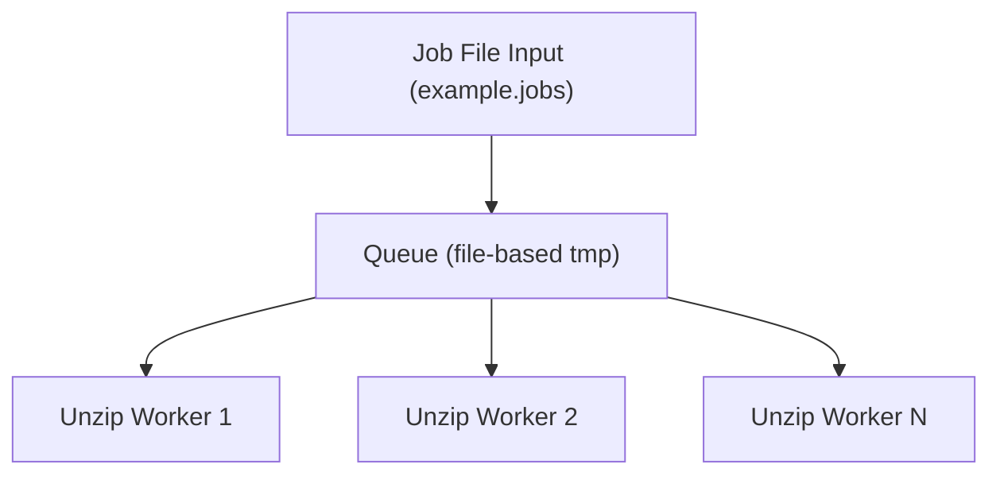
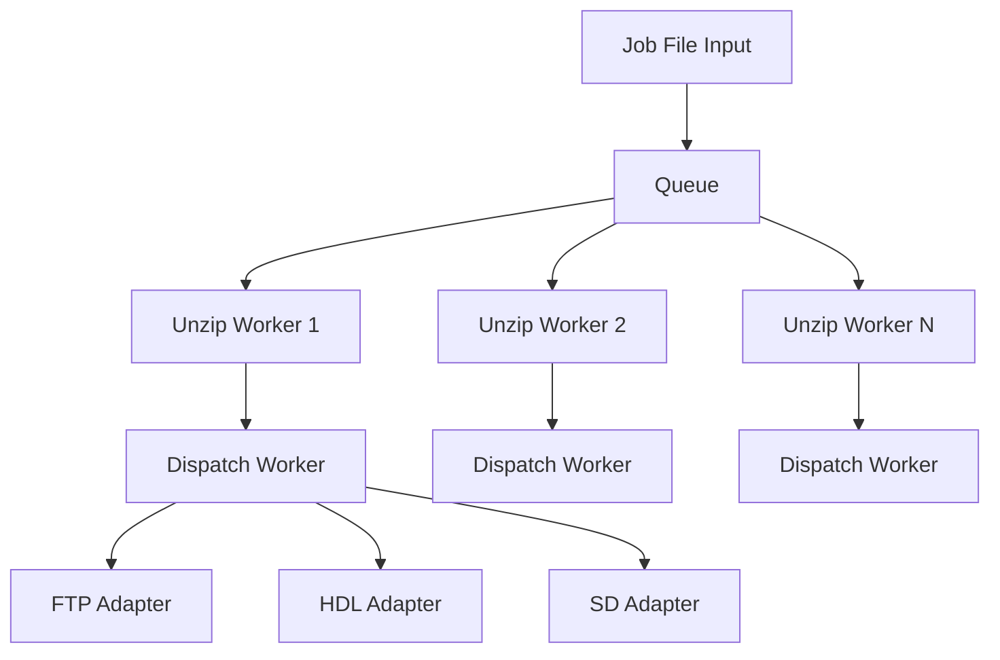
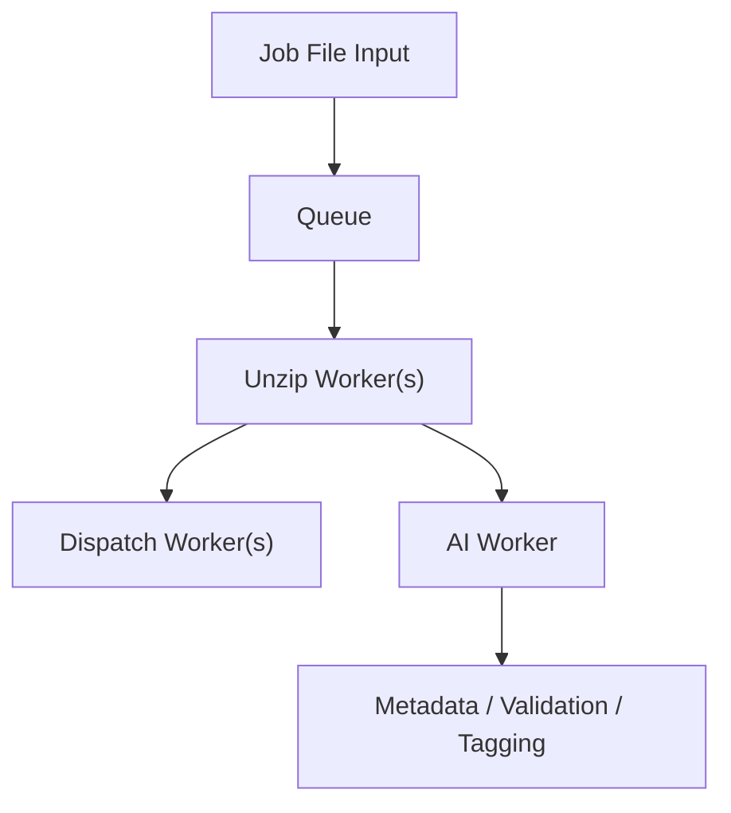
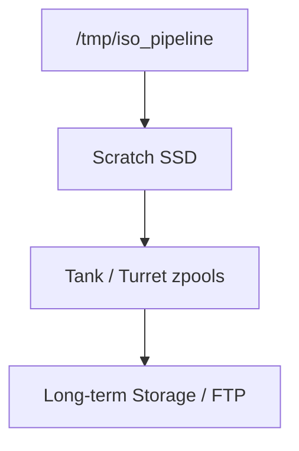
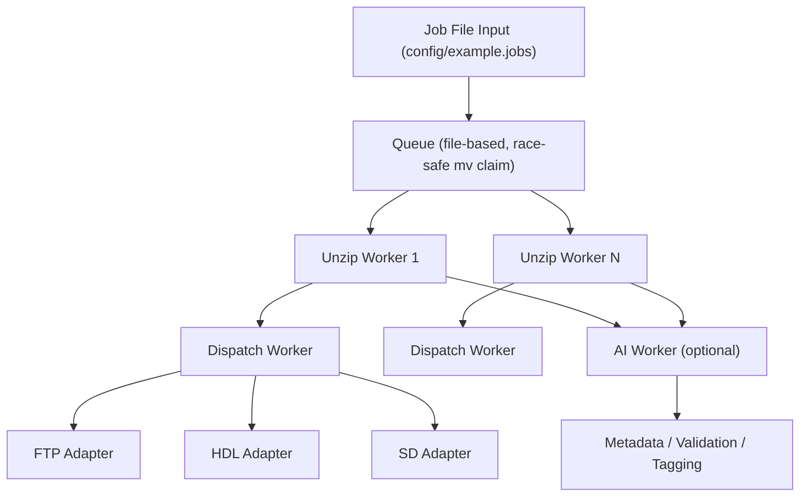

# iso-pipeline AI Agent Entry Point

This document is intended for **AI agents** or future AI workers to understand the `loadout-pipeline` system. It describes the pipeline, queue, worker modes, storage architecture, adapters, and optional features.

---

## System Overview

**iso-pipeline** is a framework for unzipping video game ISO files and dispatching them to multiple destinations. It supports:

- **Worker mode**:
  - Classic queue-based multithreaded workers (parallelism set by `MAX_UNZIP` in `lib/workers.sh`)
- **Storage management**:
  - Scratch SSD (240b) for temporary extraction
  - Tank/Turret zpools for persistent storage
- **Dispatch adapters**:
  - FTP
  - HDL (local HDDs via `hdl_dump`)
  - SD cards
- **Optional AI worker integration**:
  - Metadata tagging
  - Preprocessing
  - Validation

The system is designed to be **space-aware**, preventing the scratch SSD from overfilling, and **high-throughput**, always keeping a few files ready to dispatch.

---

## Job File Format

Jobs are defined in a text file (default: `config/example.jobs`) with the following format:
iso_path~adapter_type|adapter_destination

- `iso_path`            – absolute path to the ISO archive
- `adapter_type`        – target adapter: `ftp`, `hdl`, or `sd`
- `adapter_destination` – adapter-specific path (FTP remote path, device node, mount point)

Example:
/isos/game1.iso~ftp|/remote/path/game1
/isos/game2.iso~hdl|/dev/hdd0
/isos/game3.iso~sd|/mnt/sdcard/games

---

## Queue Architecture

The **queue** is central to iso-pipeline:

- FIFO-based job queue on scratch SSD
- Space-aware: prevents overfilling
- Supports multiple unzip workers
- Can persist pending jobs for recovery

**Classic Worker Mode**

Multiple background unzip workers read from the queue. Dispatch workers send files to adapters (FTP, HDL, SD).

---

## AI Worker Integration

- Optional AI worker can preprocess files, tag metadata, or validate ISOs
- Can run in parallel with unzip/dispatch workers

**Storage / Zpool Flow**

Scratch SSD holds temporary unzipped files. Tank/Turret zpools store persistent data. Archives are dispatched to FTP or long-term storage.

**Full Pipeline with AI Worker**

---

## Optional Features

- **Configurable worker count** via `MAX_UNZIP` in `lib/workers.sh`
- **AI preprocessing** and tagging
- **Space awareness** to limit scratch SSD usage
- **Concurrent multithreading** for unzip + dispatch

---

## Notes for AI Agents

- Read the **diagrams** to understand the flow of jobs and adapters
- Inspect **scratch SSD queue** to determine space and pending jobs
- AI workers can suggest:
  - Rebalancing workers (adjusting `MAX_UNZIP`)
  - Optimizing dispatch
- Job file parsing and adapter logic are the primary integration points for AI modifications

---

**End of AI Agent Entry Point**

