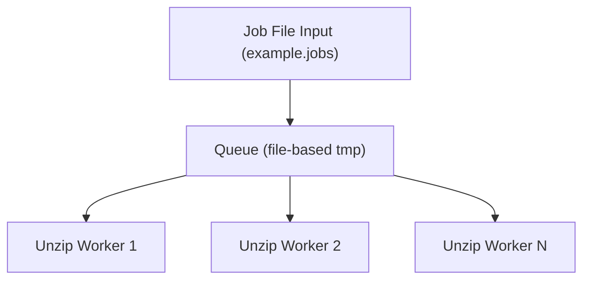
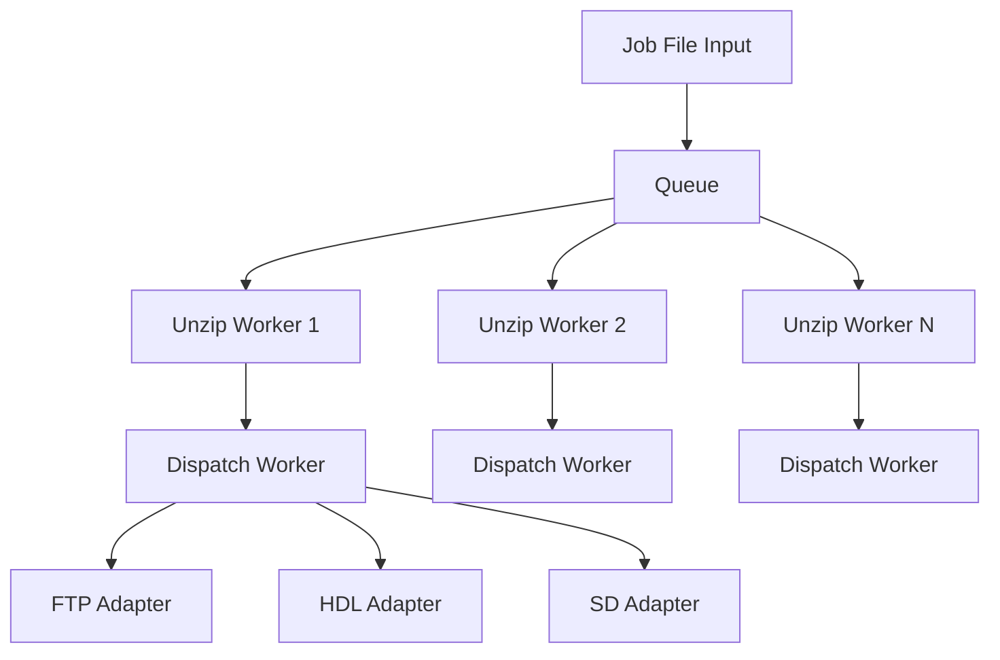
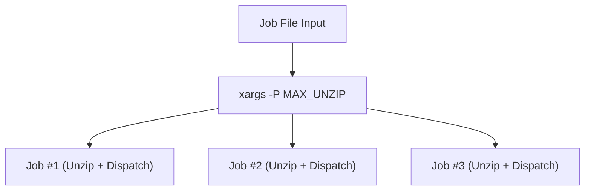
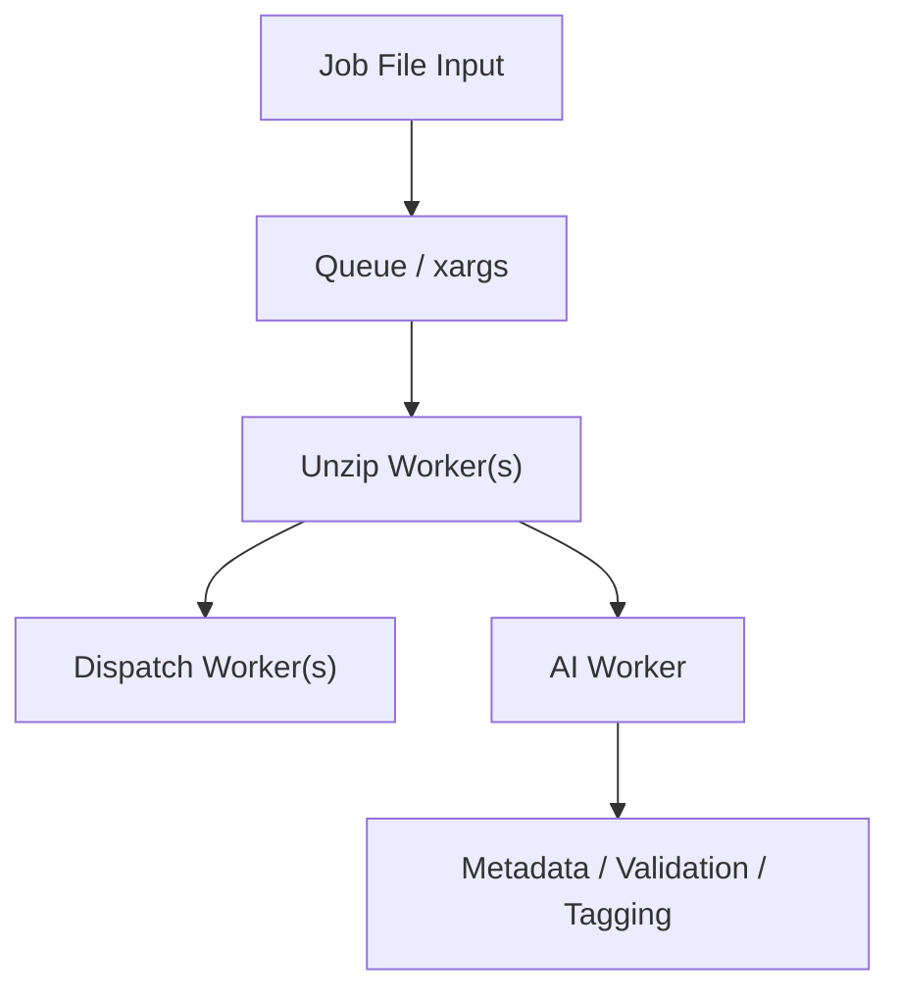
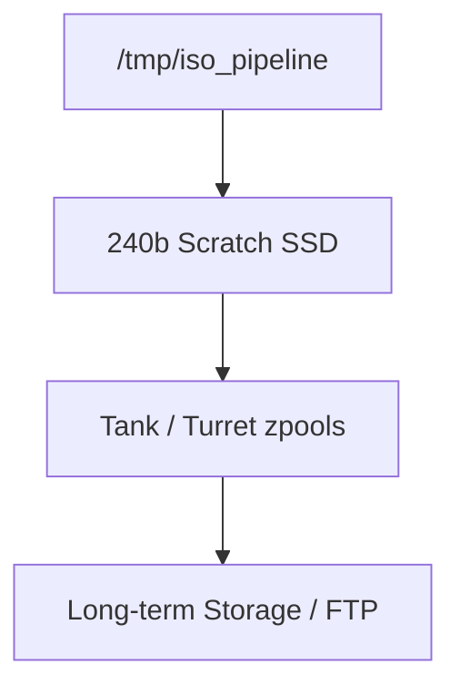
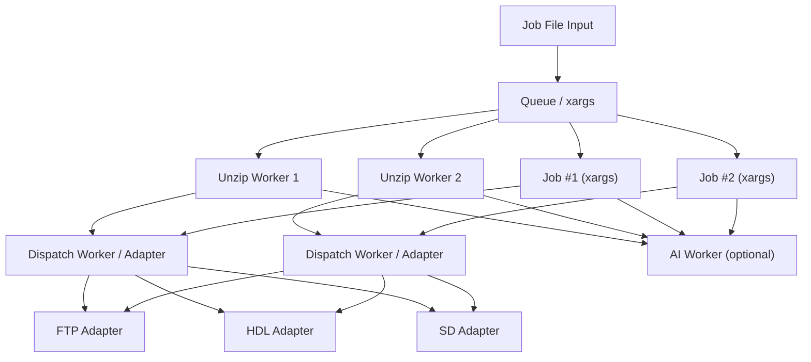

# iso-pipeline AI Agent Entry Point

This document is intended for **AI agents** or future AI workers to understand the `loadout-pipeline` system. It describes the pipeline, queue, worker modes, storage architecture, adapters, and optional features.

---

## System Overview

**iso-pipeline** is a framework for unzipping video game ISO files and dispatching them to multiple destinations. It supports:

- **Multiple worker modes**:
  - Classic queue-based multithreaded workers
  - Xargs-based parallel processing
- **Storage management**:
  - Scratch SSD (240b) for temporary extraction
  - Tank/Turret zpools for persistent storage
- **Dispatch adapters**:
  - FTP
  - HDL (local HDDs via `hdl_dump`)
  - SD cards
- **Optional AI worker integration**:
  - Metadata tagging
  - Preprocessing
  - Validation

The system is designed to be **space-aware**, preventing the scratch SSD from overfilling, and **high-throughput**, always keeping a few files ready to dispatch.

---

## Job File Format

Jobs are defined in a text file (default: `example.jobs`) with the following format:
directory~filename|destination

- `directory` – path to source file
- `filename` – ISO archive name
- `destination` – target adapter(s)

Example:
/mnt/isos~zelda.iso|ftp
/mnt/isos~mario.iso|hdl

---

## Queue Architecture

The **queue** is central to iso-pipeline:

- FIFO-based job queue on scratch SSD
- Space-aware: prevents overfilling
- Supports multiple unzip workers
- Can persist pending jobs for recovery

    Classic Worker Mode
Multiple background unzip workers read from the queue
Dispatch workers send files to adapters (FTP/HDL/SD)
Space-aware queue ensures scratch SSD is never exceeded

    Xargs Multithreaded Mode
Uses xargs -P to run multiple jobs concurrently
Each job handles unzip + dispatch
Optional space monitoring

---

## AI Worker Integration

- Optional AI worker can preprocess files, tag metadata, or validate ISOs
- Can run in parallel with unzip/dispatch workers

    Storage / Zpool Flow
Scratch SSD (240b) holds temporary unzipped files
Tank/Turret zpools store persistent data
Archives are dispatched to FTP or long-term storage

    

---

## Optional Features

- **Xargs toggle** between classic queue and xargs mode
- **AI preprocessing** and tagging
- **Space awareness** to limit scratch SSD usage
- **Concurrent multithreading** for unzip + dispatch

---

## Pipeline Comparison Table

| Feature | Classic Worker Mode | Xargs Mode |
|---------|------------------|------------|
| Parallelism control | Background workers + wait | `xargs -P` |
| Queue / space awareness | Yes | Limited (manual checks) |
| Complexity | Medium | Low |
| Logging per job | Yes | Yes (stdout/stderr) |
| Ease of extension | High (workers + adapters) | Medium (single job wrapper) |

---

## Notes for AI Agents

- Read the **diagrams** to understand the flow of jobs and adapters
- Inspect **scratch SSD queue** to determine space and pending jobs
- AI workers can suggest:
  - Switching modes
  - Rebalancing workers
  - Optimizing dispatch
- Job file parsing and adapter logic are the primary integration points for AI modifications

---

**End of AI Agent Entry Point**

