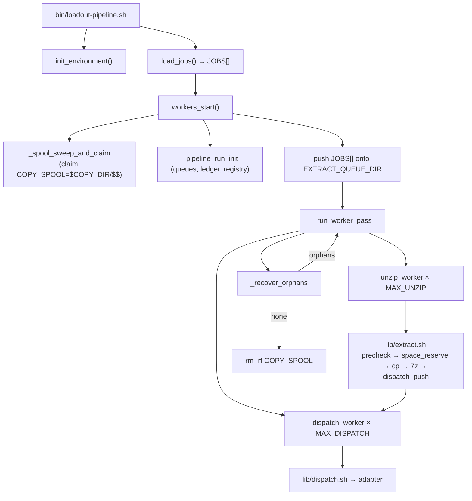

# iso-pipeline AI Agent Entry Point

This document is the primary onboarding reference for AI agents working on the `loadout-pipeline` codebase. It describes the pipeline architecture, file layout, configuration system, queue design, logging framework, and adapter extension points.

---

## System Overview

**iso-pipeline** (package name: `loadout-pipeline`) is a shell-based framework for extracting video game ISO archives and dispatching the extracted files to one or more destinations. It supports:

- **Parallel extraction** via a background worker pool (`MAX_UNZIP`) and a second pool of dispatch workers (`MAX_DISPATCH`) that run concurrently
- **Race-safe file-based queues** using atomic `mv` job claiming
- **Shared space reservation ledger** (`lib/space.sh`) — `flock`-guarded so concurrent workers never collectively over-commit scratch space
- **Per-run scratch spool isolation** (`COPY_SPOOL=$COPY_DIR/$$`) with a startup sweep of dead-PID subdirs
- **Intra-run recovery of SIGKILL'd workers** via a worker registry (`lib/worker_registry.sh`) and a recovery loop in `workers_start` capped at `MAX_RECOVERY_ATTEMPTS`
- **Multiple dispatch adapters**: FTP (stub), HDL dump (stub), SD card (**implemented**), rclone (stub), rsync (stub)
- **Pluggable adapter architecture** — add a new `adapters/<name>.sh` + case arms in `lib/dispatch.sh` and `lib/precheck.sh` + a key in the `lib/jobs.sh` regex
- **Structured logging** controlled by `DEBUG_IND`

---

## Directory Layout

```
loadout-pipeline/
├── bin/
│   └── loadout-pipeline.sh    # Entry point — sources libs, runs pipeline
├── lib/
│   ├── config.sh              # .env loader + all exported variable defaults
│   ├── logging.sh             # Logging framework + RETURN trap
│   ├── init.sh                # init_environment() — creates EXTRACT/COPY/QUEUE dirs
│   ├── job_format.sh          # parse_job_line() — canonical job-line parser (sourced everywhere)
│   ├── jobs.sh                # load_jobs() — validates and parses the job file into JOBS[]
│   ├── queue.sh               # queue_init/push/pop — atomic mv-based FIFO
│   ├── workers.sh             # workers_start, unzip_worker, dispatch_worker + recovery loop
│   ├── extract.sh             # Per-job: precheck → space_reserve → copy → 7z → dispatch push
│   ├── precheck.sh            # Per-adapter "already at destination?" check
│   ├── dispatch.sh            # Routes extracted dir to the correct adapter
│   ├── space.sh               # flock-guarded space reservation ledger
│   └── worker_registry.sh     # flock-guarded in-flight-job registry for recovery
├── adapters/
│   ├── ftp.sh                 # FTP transfer stub
│   ├── hdl_dump.sh            # HDL dump stub (PS2)
│   ├── sdcard.sh              # SD card copy — IMPLEMENTED (rsync -a / cp -r fallback)
│   ├── rclone.sh              # rclone stub
│   └── rsync.sh               # rsync stub (local or remote)
├── examples/
│   └── example.jobs
├── docs/
│   └── architecture.md
├── test/
│   ├── run_tests.sh           # 21 test cases, 94 assertions
│   └── fixtures/
│       ├── create_fixtures.sh
│       └── iso/
├── .env
└── .env.example
```

---

## Configuration

All configuration lives in `.env` (copy from `.env.example`). Variables set before the call override `.env`:

```bash
MAX_UNZIP=4 bash bin/loadout-pipeline.sh examples/example.jobs
```

Priority: caller-supplied env var > `.env` > hardcoded default in `lib/config.sh`.

**Pipeline core variables:**

| Variable                          | Default                     | Description                                                                           |
|-----------------------------------|-----------------------------|---------------------------------------------------------------------------------------|
| `DEBUG_IND`                       | `0`                         | `1` = verbose function entry/exit logging to stderr                                   |
| `MAX_UNZIP`                       | `2`                         | Parallel extract-stage workers                                                        |
| `MAX_DISPATCH`                    | `2`                         | Parallel dispatch-stage workers                                                       |
| `QUEUE_DIR`                       | `/tmp/iso_pipeline_queue`   | Parent of extract + dispatch queues, space ledger, and worker registry                |
| `EXTRACT_DIR`                     | `/tmp/iso_pipeline`         | Scratch directory for extracted ISO contents                                          |
| `COPY_DIR`                        | `/tmp/iso_pipeline_copies`  | Parent of per-run spool (`$COPY_DIR/$$` = `COPY_SPOOL`)                               |
| `SPACE_OVERHEAD_PCT`              | `20`                        | % overhead added to raw space requirement                                             |
| `MAX_RECOVERY_ATTEMPTS`           | `3`                         | Max intra-run recovery passes for SIGKILL'd workers                                   |
| `EXTRACT_STRIP_LIST`              | `$ROOT_DIR/strip.list`      | File listing filenames to delete from every extracted archive before dispatch         |
| `DISPATCH_POLL_INITIAL_MS`        | `50`                        | Starting poll interval (ms) for dispatch workers on an empty queue                    |
| `DISPATCH_POLL_MAX_MS`            | `500`                       | Maximum poll interval (ms) for the exponential dispatch backoff                       |
| `SPACE_RETRY_BACKOFF_INITIAL_SEC` | `5`                         | Initial sleep (s) for an extract worker after a space-reservation miss                |
| `SPACE_RETRY_BACKOFF_MAX_SEC`     | `60`                        | Maximum sleep (s) for the exponential space-retry backoff                             |

**Adapter variables:** FTP (`FTP_HOST/USER/PASS/PORT`), HDL (`HDL_DUMP_BIN`), SD (`SD_MOUNT_POINT`), rclone (`RCLONE_REMOTE`, `RCLONE_DEST_BASE`, `RCLONE_FLAGS`), rsync (`RSYNC_DEST_BASE`, `RSYNC_HOST`, `RSYNC_USER`, `RSYNC_SSH_PORT`, `RSYNC_FLAGS`).

All variables are exported by `lib/config.sh` so they are available to every subprocess (`extract.sh`, `dispatch.sh`, adapter scripts).

---

## Job File Format

```
~iso_path|adapter_type|adapter_destination~
```

| Field                 | Description                                              |
|-----------------------|----------------------------------------------------------|
| `iso_path`            | Absolute path to the `.7z` archive                       |
| `adapter_type`        | One of: `ftp`, `hdl`, `sd`, `rclone`, `rsync`            |
| `adapter_destination` | Adapter-specific target                                  |

Example (`examples/example.jobs`):

```
~/isos/game1.7z|ftp|/remote/path/game1~
~/isos/game2.7z|hdl|/dev/hdd0~
~/isos/game3.7z|sd|games/game3~
```

Blank lines and lines starting with `#` are ignored.

---

## Pipeline Flow



**Key design points:**
- Extract and dispatch pools run **concurrently**, draining separate queues — dispatch of job N overlaps extraction of job N+1.
- Every extract worker calls `worker_job_begin` before `extract.sh` and `worker_job_end` after. Any entry remaining after all workers exit is an orphan from a SIGKILL'd worker and gets re-queued for another pass.
- `extract.sh` runs `space_reserve` under a `flock` before copying anything. If the job doesn't fit right now, it exits 75 and `unzip_worker` re-queues it with backoff.

---

## Space Ledger (`lib/space.sh`)

- `space_reserve` takes an exclusive `flock` on `$QUEUE_DIR/.space_ledger.lock`, then inside the lock reads the ledger, calls `df`, decides, and appends the reservation. The entire check-and-commit is atomic.
- Shared-filesystem pooling: if `COPY_DIR` and `EXTRACT_DIR` live on the same device (`stat -c %d`), both reservations are pooled against a single `df` number.
- `SPACE_OVERHEAD_PCT` (default 20) inflates the byte requirement. Formula: `(archive_bytes + extracted_bytes) × (1 + pct/100)`.
- `extract.sh`'s EXIT trap calls `space_release` on every clean exit. `space_init` truncates the ledger at the start of every run so SIGKILL stragglers can't leak into the next run.
- Test hook: `SPACE_AVAIL_OVERRIDE_BYTES` replaces the real `df` lookup.

---

## Worker Registry (`lib/worker_registry.sh`) & Recovery Loop

- `queue_pop` atomically removes a job from the queue, so a SIGKILL'd worker would make the job simply vanish.
- The registry writes `<pid> <job>` on `worker_job_begin` and removes it on `worker_job_end`. All mutations are `flock`-guarded.
- After a worker pass, `_recover_orphans` reads any remaining entries, re-queues them, and `workers_start` runs another pass. The loop caps at `MAX_RECOVERY_ATTEMPTS` (default 3).
- Re-running the pipeline separately is also safe: `workers_start` re-pushes all `JOBS[]` and precheck skips jobs already delivered.

---

## Per-Run Scratch Spool

`COPY_DIR` is shared across runs. Each run claims `$COPY_DIR/$$` and exports it as `COPY_SPOOL`. `extract.sh` reads `${COPY_SPOOL:-$COPY_DIR}` so it always copies into the owning run's subdir. At startup, `_spool_sweep_and_claim` deletes subdirs whose PID is no longer alive (`kill -0` fails) — safe against concurrent instances, which each own a different live PID.

At the end of `workers_start`, `rm -rf "$COPY_SPOOL"` removes the whole subdir, guaranteeing cleanup even for SIGKILL'd extracts whose EXIT trap never fired.

---

## Queue Design

The queues are directories of `.job` files. Filenames are nanosecond timestamps for natural FIFO ordering. `queue_pop` uses `mv` to atomically claim a file — only one worker wins per filename, preventing double-processing without locks. Two queues: `EXTRACT_QUEUE_DIR` and `DISPATCH_QUEUE_DIR`.

---

## Logging Framework (`lib/logging.sh`)

Controlled by `DEBUG_IND`. All output goes to **stderr**.

| Function    | `DEBUG_IND=0` | `DEBUG_IND=1`                                     |
|-------------|---------------|---------------------------------------------------|
| `log_enter` | no-op         | `[DEBUG] → <caller>()`                            |
| `log_debug` | no-op         | `[DEBUG]   <caller>: <message>`                   |
| `log_trace` | no-op         | `[DEBUG] <message>` (use in subprocess scripts)   |
| `log_warn`  | always on     | `[WARN]  <message>`                               |
| `log_error` | always on     | `[ERROR] <message>`                               |

With `DEBUG_IND=1`, a `RETURN` trap auto-logs every function exit in sourced libs. Subprocess scripts do not inherit the trap — use `log_trace` there.

---

## Source Order in `bin/loadout-pipeline.sh`

`lib/config.sh` must be sourced **first**, then `lib/logging.sh` **second** (its RETURN trap must precede function definitions), then the remaining libs:

```bash
source "$ROOT_DIR/lib/config.sh"
source "$ROOT_DIR/lib/logging.sh"
source "$ROOT_DIR/lib/init.sh"
source "$ROOT_DIR/lib/jobs.sh"
source "$ROOT_DIR/lib/queue.sh"
source "$ROOT_DIR/lib/workers.sh"
```

`lib/space.sh` and `lib/worker_registry.sh` are sourced lazily from inside `workers_start` (via `_pipeline_run_init`).

---

## Adapters

| Adapter  | Key      | Script                 | Status          | Required env vars                                                             |
|----------|----------|------------------------|-----------------|-------------------------------------------------------------------------------|
| FTP      | `ftp`    | `adapters/ftp.sh`      | Stub            | `FTP_HOST`, `FTP_USER`, `FTP_PASS`, `FTP_PORT`                                |
| HDL dump | `hdl`    | `adapters/hdl_dump.sh` | Stub            | `HDL_DUMP_BIN`                                                                |
| SD card  | `sd`     | `adapters/sdcard.sh`   | **Implemented** | `SD_MOUNT_POINT`                                                              |
| rclone   | `rclone` | `adapters/rclone.sh`   | Stub            | `RCLONE_REMOTE`, `RCLONE_DEST_BASE`, `RCLONE_FLAGS`                           |
| rsync    | `rsync`  | `adapters/rsync.sh`    | Stub            | `RSYNC_DEST_BASE`, `RSYNC_HOST`, `RSYNC_USER`, `RSYNC_SSH_PORT`, `RSYNC_FLAGS`|

Stub adapters log what they would do but do not transfer files. The SD card adapter is fully implemented: it validates `SD_MOUNT_POINT`, performs a path-containment check against the mount root, and copies using `rsync -a` (with a `cp -r` fallback when rsync is unavailable).

Each adapter receives `$1` = source directory (extracted contents) and `$2` = adapter-specific destination.

To add a new adapter:
1. Create `adapters/<name>.sh`.
2. Add a `<name>)` case to `lib/dispatch.sh`.
3. Add a `<name>)` case to `lib/precheck.sh` (or accept the default "not present" stub).
4. Extend the regex in `lib/jobs.sh` to accept the new key.
5. Add any required env vars to `lib/config.sh` and `.env.example`.

---

## Notes for AI Agents

- **Entry point** is `bin/loadout-pipeline.sh` — a thin orchestrator.
- **All defaults** live in `lib/config.sh`; library files do not set them.
- **Source order matters**: `config.sh` first, `logging.sh` second.
- **`log_enter` uses `FUNCNAME[1]`** — no argument needed.
- **Subprocess scripts** (`extract.sh`, `dispatch.sh`) don't inherit the RETURN trap — use `log_trace`.
- **Space reservations are mandatory** for any worker touching scratch disk — call `space_reserve` under the flock and `space_release` in an EXIT trap.
- **Any worker touching the extract queue** must bracket its work with `worker_job_begin` / `worker_job_end` so intra-run recovery can detect orphans.
- **`COPY_SPOOL` is the per-run scratch dir** — `extract.sh` reads `${COPY_SPOOL:-$COPY_DIR}`. Never hard-code `COPY_DIR` as a destination.
- **Strip list runs before dispatch** — after successful extraction, `extract.sh` deletes any filenames listed in `EXTRACT_STRIP_LIST` (default `strip.list`) from the extracted directory before pushing to the dispatch queue. `precheck.sh` is strip-list aware and does not require stripped files to be present at the destination.
- **SD card adapter is fully implemented** — all other adapters are stubs. See the `TODO` markers in each stub for implementation guidance.
- **Credentials are scoped per adapter** — `lib/dispatch.sh` uses `env -u` to strip every other adapter's env vars before forking the target adapter. Only the vars the active adapter needs are visible to it.

---

**End of AI Agent Entry Point**
