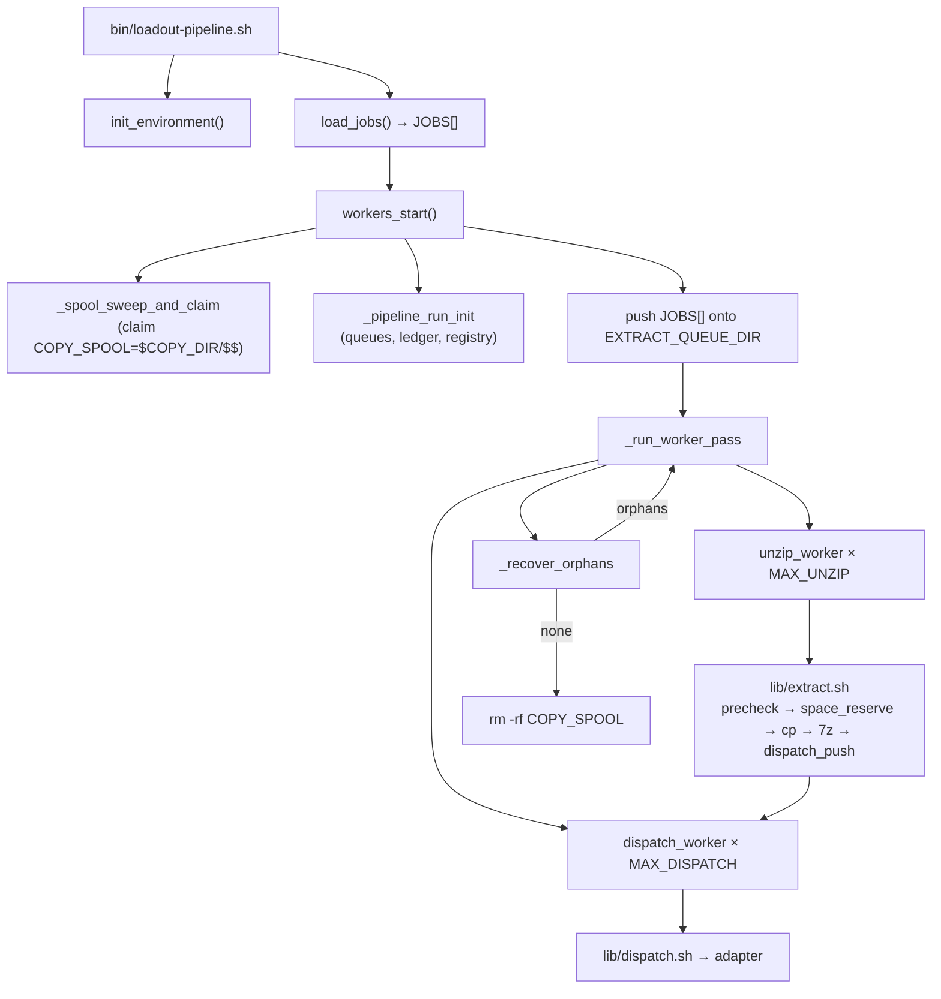

# iso-pipeline AI Agent Entry Point

This document is the primary onboarding reference for AI agents working on the `loadout-pipeline` codebase. It describes the pipeline architecture, file layout, configuration system, queue design, logging framework, and adapter extension points.

---

## System Overview

**iso-pipeline** (package name: `loadout-pipeline`) is a shell-based framework for extracting video game ISO archives and dispatching the extracted files to one or more destinations. It supports:

- **Parallel extraction** via a background worker pool (`MAX_UNZIP`) and a second pool of dispatch workers (`MAX_DISPATCH`) that run concurrently
- **Race-safe file-based queues** using atomic `mv` job claiming
- **Shared space reservation ledger** (`lib/space.sh`) — `flock`-guarded so concurrent workers never collectively over-commit scratch space
- **Per-run scratch spool isolation** (`COPY_SPOOL=$COPY_DIR/$$`) with a startup sweep of dead-PID subdirs
- **Intra-run recovery of SIGKILL'd workers** via a worker registry (`lib/worker_registry.sh`) and a recovery loop in `workers_start` capped at `MAX_RECOVERY_ATTEMPTS`
- **Multiple dispatch adapters**: FTP (stub), HDL dump (**implemented**), local volume (**implemented**), rclone (stub), rsync (**implemented**)
- **Pluggable adapter architecture** — add a new `adapters/<name>.sh` + case arms in `lib/dispatch.sh` and `lib/precheck.sh` + a key in the `lib/jobs.sh` regex
- **Structured logging** controlled by `DEBUG_IND`

---

## Backwards Compatibility (REQUIRED)

**The public interface surface of this pipeline is frozen.** Any change that renames, removes, or silently alters the meaning of anything in the list below is a breaking change and must NOT be made without an explicit major-version bump and a migration note in the commit message. Additions are always allowed; subtractions and renames are not.

This rule applies to every PR, whether written by a human or an AI agent. If you find yourself wanting to rename an env var "for consistency" or drop a CLI flag "because nobody uses it," stop and propose a new one instead.

### What counts as public

**CLI entry points and their arguments**

- `bin/loadout-pipeline.sh <jobs_file_or_profile_dir>` — the single positional argument and its dual semantics (file OR directory of `*.jobs` files). No new positional arguments may be added; features go through env vars or flags.
- Build entry point: `build/bundle.sh` producing `dist/loadout-pipeline.sh`.

**Environment variables** (all declared with defaults in `lib/config.sh`)

- Pipeline core: `DEBUG_IND`, `RESUME_PLANNER_IND`, `MAX_UNZIP`, `MAX_DISPATCH`, `MAX_RECOVERY_ATTEMPTS`
- Directories: `SCRATCH_DISK_DIR`, `QUEUE_DIR`, `EXTRACT_QUEUE_DIR`, `DISPATCH_QUEUE_DIR`, `EXTRACT_DIR`, `COPY_DIR`
- Space: `SPACE_OVERHEAD_PCT`, `SPACE_RETRY_BACKOFF_INITIAL_SEC`, `SPACE_RETRY_BACKOFF_MAX_SEC`
- Dispatch tuning: `DISPATCH_POLL_INITIAL_MS`, `DISPATCH_POLL_MAX_MS`
- Strip list: `EXTRACT_STRIP_LIST`
- FTP adapter: `FTP_HOST`, `FTP_USER`, `FTP_PASS`, `FTP_PORT`
- HDL adapter: `HDL_DUMP_BIN`, `HDL_HOST_DEVICE`, `HDL_INSTALL_TARGET`
- Local volume adapter: `LVOL_MOUNT_POINT`
- rclone adapter: `RCLONE_REMOTE`, `RCLONE_DEST_BASE`, `RCLONE_FLAGS`
- rsync adapter: `RSYNC_DEST_BASE`, `RSYNC_HOST`, `RSYNC_USER`, `RSYNC_SSH_PORT`, `RSYNC_FLAGS`

Exit-code semantics of these vars' validation failures (`exit 2` on bad input, with the offending name in stderr) are also frozen — tooling parses for that.

**File formats**

- **Job file syntax**: `~<src>|<adapter>|<dest>~`, one per line. Adapter keys are `ftp`, `hdl`, `lvol`, `rclone`, `rsync`. Blank lines, `#` line comments, and `/* ... */` block comments are ignored. An optional `---JOBS---` header and `---END---` footer may bracket the job section; files without these markers parse identically (the whole file is body). The tilde delimiters and pipe separators are part of the contract. The three existing fields are frozen; additional `|`-delimited fields may be appended after the destination without breaking existing three-field lines (they are absorbed into `destination_spec` by `parse_job_line`).
- **`.env` file**: `KEY=value` pairs, `#` comments, CRLF tolerance, non-identifier keys silently skipped, caller-supplied env values always win over file values. All of this is locked in — suite 18 C1–C8 pins the edge cases.
- **Strip list file**: one bare filename per line (no path separators), blank lines and `#` comments allowed.

**Adapter contract**

- Every `adapters/<name>.sh` must accept exactly two positional arguments: `<src_dir> <dest_subpath>`. The calling shape `bash adapters/foo.sh SRC DEST` is frozen. Stub adapters (ftp, rclone) must refuse with `rc=1` and a log message containing the word "stub" unless `ALLOW_STUB_ADAPTERS=1` — suite 20 A1 pins this as a regression guard against any adapter carrying a `STATUS: STUB` banner.

**Internal helper contracts that have unit tests**

Any helper function whose behavior is pinned by a unit test in `test/suites/14_` through `test/suites/20_` is considered semi-public: the helper itself is still `_prefixed` and internal, but its tested behavior cannot change without updating the test deliberately and justifying the change in the commit message. The unit suite is the regression fence.

### Exemptions (NOT frozen)

1. **Test hooks**. `SPACE_AVAIL_OVERRIDE_BYTES` (documented as a test hook in `lib/space.sh:73-76`) and `ALLOW_STUB_ADAPTERS` are test scaffolding, not user-facing controls. They may be renamed or removed as the test suite evolves. Production users should never rely on them.
2. **`tools/perf/`**. The perf framework under `tools/perf/` (CLI flags of `perf_harness.sh`, `perf_report.sh`, `perf_metrics.sh`, `perf_recommender.sh`) is new as of this session and has not yet been exercised against real hardware. Breaking changes are allowed there until the first real sweep has been captured in git. Once stabilized, promote it into this policy.
3. **Private helpers without unit tests**. Any `_prefixed` function in `lib/` that no test in `test/suites/` exercises is internal and may be refactored freely. If you want to lock in a helper's behavior, add a unit test first.
4. **Internal log message wording** (except for the two strings that tooling greps for: `"space reservation miss"` in `lib/workers.sh` and `"stub"` in the stub adapters). Everything else in the log output is cosmetic and may be reworded.

### How to add without breaking

- **New env var**: add it with a default in `lib/config.sh`, document it in the README's Configuration section, and add the validation branch if it is numeric. Never repurpose an existing var name. Never change an existing default.
- **New CLI flag**: add a new `--flag` to the same entry-point script. Never change the meaning of an existing flag or positional argument.
- **New adapter**: drop a new file under `adapters/` and register it in `lib/dispatch.sh`, `lib/precheck.sh`, and the `lib/jobs.sh` regex. Existing adapters' 2-arg contracts are untouched.
- **New job-line field**: additional `|`-delimited fields may be appended after the third pipe (destination). The grammar regex in `lib/jobs.sh` allows `(\|field)*` after the destination, and `parse_job_line`'s `IFS='|' read -r` absorbs extras into `destination_spec`. Existing three-field lines parse unchanged. Consumers needing field 4+ use an adapter-specific parser — the hdl adapter is the live example (`parse_hdl_destination` in `lib/job_format.sh` splits `format|title` out of `destination_spec`, and `load_jobs` invokes it on every hdl row for a load-time error rather than a dispatch-time one).

### Verification

Before merging any change, run `bash test/run_tests.sh` and confirm the assertion count is **≥ 458** (today's baseline) with **0 failures**. A dropping assertion count means a pinned behavior has been silently removed — investigate before merging.

---

## Directory Layout

```
loadout-pipeline/
├── bin/
│   └── loadout-pipeline.sh    # Entry point — sources libs, runs pipeline
├── lib/
│   ├── config.sh              # .env loader + all exported variable defaults
│   ├── logging.sh             # Logging framework + RETURN trap
│   ├── init.sh                # init_environment() — creates EXTRACT/COPY/QUEUE dirs
│   ├── job_format.sh          # parse_job_line() — canonical job-line parser (sourced everywhere)
│   ├── jobs.sh                # load_jobs() — validates and parses the job file into JOBS[]
│   ├── queue.sh               # queue_init/push/pop — atomic mv-based FIFO
│   ├── workers.sh             # workers_start, unzip_worker, dispatch_worker + recovery loop
│   ├── extract.sh             # Per-job: precheck → space_reserve → copy → 7z → dispatch push
│   ├── precheck.sh            # Per-adapter "already at destination?" check
│   ├── dispatch.sh            # Routes extracted dir to the correct adapter
│   ├── space.sh               # flock-guarded space reservation ledger
│   ├── worker_registry.sh     # flock-guarded in-flight-job registry for recovery
│   ├── prereq.sh              # Preflight runtime-dependency check
│   ├── resume_planner.sh      # Resume-plan generator for cold restarts
│   └── strip_list.sh          # strip_list_contains() — bare-filename lookup
├── adapters/
│   ├── ftp.sh                 # FTP transfer stub
│   ├── hdl_dump.sh            # HDL dump adapter — IMPLEMENTED (PS2 inject via hdl_dump)
│   ├── lvol.sh              # Local volume copy — IMPLEMENTED (rsync -a / cp -r fallback)
│   ├── rclone.sh              # rclone stub
│   └── rsync.sh               # rsync adapter (local or remote via SSH)
├── tools/
│   └── perf/                  # Performance harness, report, metrics, recommender
├── examples/
│   └── example.jobs
├── docs/
│   ├── requirements/          # Per-function contract (authoritative spec)
│   │   └── index.md           # Subsystem table + alphabetical function index
│   └── architecture.md
├── test/
│   ├── run_tests.sh           # Test runner (105 test cases, 458 assertions)
│   ├── validate_tests.sh      # Mutation validation (57 V-checks)
│   └── fixtures/
│       ├── create_fixtures.sh
│       └── iso/
├── .env
└── .env.example
```

---

## Configuration

All configuration lives in `.env` (copy from `.env.example`). Variables set before the call override `.env`:

```bash
MAX_UNZIP=4 bash bin/loadout-pipeline.sh examples/example.jobs
```

Priority: caller-supplied env var > `.env` > hardcoded default in `lib/config.sh`.

**Pipeline core variables:**

| Variable                          | Default                                 | Description                                                                                           |
| --------------------------------- | --------------------------------------- | ----------------------------------------------------------------------------------------------------- |
| `DEBUG_IND`                       | `0`                                     | `0` silent, `1` debug (entry/exit + log_debug/trace), `2` extended (adds log_cmd/var/fs/xtrace + rc=) |
| `MAX_UNZIP`                       | `2`                                     | Parallel extract-stage workers                                                                        |
| `MAX_DISPATCH`                    | `2`                                     | Parallel dispatch-stage workers                                                                       |
| `SCRATCH_DISK_DIR`                | `/tmp`                                  | Root for all scratch I/O; child dirs derive from this                                                 |
| `QUEUE_DIR`                       | `$SCRATCH_DISK_DIR/iso_pipeline_queue`  | Parent of extract + dispatch queues, space ledger, and worker registry                                |
| `EXTRACT_DIR`                     | `$SCRATCH_DISK_DIR/iso_pipeline`        | Scratch directory for extracted ISO contents                                                          |
| `COPY_DIR`                        | `$SCRATCH_DISK_DIR/iso_pipeline_copies` | Parent of per-run spool (`$COPY_DIR/$$` = `COPY_SPOOL`)                                               |
| `SPACE_OVERHEAD_PCT`              | `20`                                    | % overhead added to raw space requirement                                                             |
| `MAX_RECOVERY_ATTEMPTS`           | `3`                                     | Max intra-run recovery passes for SIGKILL'd workers                                                   |
| `EXTRACT_STRIP_LIST`              | `$ROOT_DIR/strip.list`                  | File listing filenames to delete from every extracted archive before dispatch                         |
| `DISPATCH_POLL_INITIAL_MS`        | `50`                                    | Starting poll interval (ms) for dispatch workers on an empty queue                                    |
| `DISPATCH_POLL_MAX_MS`            | `500`                                   | Maximum poll interval (ms) for the exponential dispatch backoff                                       |
| `SPACE_RETRY_BACKOFF_INITIAL_SEC` | `5`                                     | Initial sleep (s) for an extract worker after a space-reservation miss                                |
| `SPACE_RETRY_BACKOFF_MAX_SEC`     | `60`                                    | Maximum sleep (s) for the exponential space-retry backoff                                             |

**Adapter variables:** FTP (`FTP_HOST/USER/PASS/PORT`), HDL (`HDL_DUMP_BIN`, `HDL_HOST_DEVICE`, `HDL_INSTALL_TARGET`), lvol (`LVOL_MOUNT_POINT`), rclone (`RCLONE_REMOTE`, `RCLONE_DEST_BASE`, `RCLONE_FLAGS`), rsync (`RSYNC_DEST_BASE`, `RSYNC_HOST`, `RSYNC_USER`, `RSYNC_SSH_PORT`, `RSYNC_FLAGS`).

All variables are exported by `lib/config.sh` so they are available to every subprocess (`extract.sh`, `dispatch.sh`, adapter scripts).

---

## Job File Format

```
~iso_path|adapter_type|adapter_destination~
```

| Field                 | Description                                     |
| --------------------- | ----------------------------------------------- |
| `iso_path`            | Absolute path to the `.7z` archive              |
| `adapter_type`        | One of: `ftp`, `hdl`, `lvol`, `rclone`, `rsync` |
| `adapter_destination` | Adapter-specific target                         |

Example (`examples/example.jobs`):

```
~/isos/game1.7z|ftp|/remote/path/game1~
~/isos/game2.7z|hdl|dvd|Example PS2 Title~
~/isos/game3.7z|lvol|games/game3~
```

Blank lines and lines starting with `#` are ignored.

---

## Pipeline Flow



**Key design points:**
- Extract and dispatch pools run **concurrently**, draining separate queues — dispatch of job N overlaps extraction of job N+1.
- Every extract worker calls `worker_job_begin` before `extract.sh` and `worker_job_end` after. Any entry remaining after all workers exit is an orphan from a SIGKILL'd worker and gets re-queued for another pass.
- `extract.sh` runs `space_reserve` under a `flock` before copying anything. If the job doesn't fit right now, it exits 75 and `unzip_worker` re-queues it with backoff.

---

## Space Ledger (`lib/space.sh`)

- `space_reserve` takes an exclusive `flock` on `$QUEUE_DIR/.space_ledger.lock`, then inside the lock reads the ledger, calls `df`, decides, and appends the reservation. The entire check-and-commit is atomic.
- Shared-filesystem pooling: if `COPY_DIR` and `EXTRACT_DIR` live on the same device (`stat -c %d`), both reservations are pooled against a single `df` number.
- `SPACE_OVERHEAD_PCT` (default 20) inflates the byte requirement. Formula: `(archive_bytes + extracted_bytes) × (1 + pct/100)`.
- `extract.sh`'s EXIT trap calls `space_release` on every clean exit. `space_init` truncates the ledger at the start of every run so SIGKILL stragglers can't leak into the next run.
- Test hook: `SPACE_AVAIL_OVERRIDE_BYTES` replaces the real `df` lookup.

---

## Worker Registry (`lib/worker_registry.sh`) & Recovery Loop

- `queue_pop` atomically removes a job from the queue, so a SIGKILL'd worker would make the job simply vanish.
- The registry writes `<pid> <job>` on `worker_job_begin` and removes it on `worker_job_end`. All mutations are `flock`-guarded.
- After a worker pass, `_recover_orphans` reads any remaining entries, re-queues them, and `workers_start` runs another pass. The loop caps at `MAX_RECOVERY_ATTEMPTS` (default 3).
- Re-running the pipeline separately is also safe: `workers_start` re-pushes all `JOBS[]` and precheck skips jobs already delivered.

---

## Per-Run Scratch Spool

`COPY_DIR` is shared across runs. Each run claims `$COPY_DIR/$$` and exports it as `COPY_SPOOL`. `extract.sh` reads `${COPY_SPOOL:-$COPY_DIR}` so it always copies into the owning run's subdir. At startup, `_spool_sweep_and_claim` deletes subdirs whose PID is no longer alive (`kill -0` fails) — safe against concurrent instances, which each own a different live PID.

At the end of `workers_start`, `rm -rf "$COPY_SPOOL"` removes the whole subdir, guaranteeing cleanup even for SIGKILL'd extracts whose EXIT trap never fired.

---

## Queue Design

The queues are directories of `.job` files. Filenames are nanosecond timestamps for natural FIFO ordering. `queue_pop` uses `mv` to atomically claim a file — only one worker wins per filename, preventing double-processing without locks. Two queues: `EXTRACT_QUEUE_DIR` and `DISPATCH_QUEUE_DIR`.

---

## Logging Framework (`lib/logging.sh`)

Controlled by `DEBUG_IND`. Strictly hierarchical — level 2 emits everything level 1 emits, plus level-2-only helpers. The value is validated in `lib/config.sh` to `{0, 1, 2}`; anything else aborts startup with exit 2. Debug output goes to **stderr**; `log_info` is the sole stdout writer.

| Function     | Level | Output format                                | Purpose                                                      |
| ------------ | ----- | -------------------------------------------- | ------------------------------------------------------------ |
| `log_info`   | all   | `[pipeline] <message>` (stdout)              | Operator-facing milestones from `bin/loadout-pipeline.sh`    |
| `log_warn`   | all   | `[WARN]  <message>`                          | Warnings — never gated                                       |
| `log_error`  | all   | `[ERROR] <message>`                          | Errors — never gated; does NOT exit (callers decide)         |
| `log_enter`  | 1+    | `[DEBUG] → <caller>()` (level 2: `(<args>)`) | Function entry; caller passes `"$@"` to echo args at level 2 |
| `log_debug`  | 1+    | `[DEBUG]   <caller>: <message>`              | Arbitrary debug message attributed to caller                 |
| `log_trace`  | 1+    | `[DEBUG] <message>`                          | Raw trace for subprocess scripts (no `FUNCNAME` context)     |
| `log_cmd`    | 2     | `[DEBUG2] cmd: <cmd> <args>`                 | Exact external command about to run — audit at the call site |
| `log_var`    | 2     | `[DEBUG2]   <caller>: <name>=<value>`        | Indirect variable dump — pass the NAME, not the value        |
| `log_fs`     | 2     | `[DEBUG2] fs: <op> <paths>`                  | Filesystem mutations (mv, rm, mkdir, flock acquire/release)  |
| `log_xtrace` | 2     | `[DEBUG2] <message>`                         | Extended raw trace for subprocess scripts                    |

At level 1 and 2, a `RETURN` trap (`set -o functrace`) auto-logs every function exit in sourced libs. Level 2 additionally shows `rc=<code>` on the exit line so non-zero returns are visible without grepping. Note: bash captures `$?` in the RETURN trap from the last command in the function body, not from an explicit `return N` — if you need the trap to show a non-zero code, make the final command produce that status rather than using `return 7`. Subprocess scripts do not inherit the trap — use `log_trace` / `log_xtrace` there.

---

## Source Order in `bin/loadout-pipeline.sh`

`lib/config.sh` must be sourced **first**, then `lib/logging.sh` **second** (its RETURN trap must precede function definitions), then the remaining libs:

```bash
source "$ROOT_DIR/lib/config.sh"
source "$ROOT_DIR/lib/logging.sh"
source "$ROOT_DIR/lib/init.sh"
source "$ROOT_DIR/lib/jobs.sh"
source "$ROOT_DIR/lib/queue.sh"
source "$ROOT_DIR/lib/workers.sh"
```

`lib/space.sh` and `lib/worker_registry.sh` are sourced lazily from inside `workers_start` (via `_pipeline_run_init`).

---

## Adapters

| Adapter   | Key      | Script                 | Status          | Required env vars                                                              |
| --------- | -------- | ---------------------- | --------------- | ------------------------------------------------------------------------------ |
| FTP       | `ftp`    | `adapters/ftp.sh`      | Stub            | `FTP_HOST`, `FTP_USER`, `FTP_PASS`, `FTP_PORT`                                 |
| HDL dump  | `hdl`    | `adapters/hdl_dump.sh` | **Implemented** | `HDL_DUMP_BIN`, `HDL_HOST_DEVICE`, `HDL_INSTALL_TARGET`                        |
| Local vol | `lvol`   | `adapters/lvol.sh`     | **Implemented** | `LVOL_MOUNT_POINT`                                                             |
| rclone    | `rclone` | `adapters/rclone.sh`   | Stub            | `RCLONE_REMOTE`, `RCLONE_DEST_BASE`, `RCLONE_FLAGS`                            |
| rsync     | `rsync`  | `adapters/rsync.sh`    | **Implemented** | `RSYNC_DEST_BASE`, `RSYNC_HOST`, `RSYNC_USER`, `RSYNC_SSH_PORT`, `RSYNC_FLAGS` |

Stub adapters (ftp, rclone) log what they would do but do not transfer files. The local volume adapter is fully implemented: it validates `LVOL_MOUNT_POINT`, performs a path-containment check against the mount root, and copies using `rsync -a` (with a `cp -r` fallback when rsync is unavailable). It works with SD cards, USB drives, NVMe/SSD/HDD enclosures, or any locally-mounted path. The rsync adapter is also fully implemented: it transfers files via `rsync -avzc --partial --append-verify` with support for both local and remote (SSH) destinations. The hdl_dump adapter is implemented: it unpacks the 4-field hdl job line (`<iso>|hdl|<cd|dvd>|<title>`) via `parse_hdl_destination` and invokes `hdl_dump inject_cd`/`inject_dvd "$HDL_INSTALL_TARGET" <title> <iso>`. The PS2 device designators are operator-wide env vars, not per-job fields: `HDL_INSTALL_TARGET` (e.g. `hdd0:`) is the inject target, and `HDL_HOST_DEVICE` (e.g. `sri:`) is a startup-probe target that `bin/loadout-pipeline.sh` uses to fail fast if `hdl_dump toc` cannot reach the HDD. The adapter relies on the operator's real `~/.hdl_dump.conf` for `<device>:` → host-path resolution; no scratch-HOME redirection is used.

Each adapter receives `$1` = source directory (extracted contents) and `$2` = adapter-specific destination.

To add a new adapter:
1. Create `adapters/<name>.sh`.
2. Add a `<name>)` case to `lib/dispatch.sh`.
3. Add a `<name>)` case to `lib/precheck.sh` (or accept the default "not present" stub).
4. Extend the regex in `lib/jobs.sh` to accept the new key.
5. Add any required env vars to `lib/config.sh` and `.env.example`.

---

## Notes for AI Agents

- **Entry point** is `bin/loadout-pipeline.sh` — a thin orchestrator.
- **All defaults** live in `lib/config.sh`; library files do not set them.
- **Source order matters**: `config.sh` first, `logging.sh` second.
- **`log_enter` uses `FUNCNAME[1]`** — no argument needed.
- **Subprocess scripts** (`extract.sh`, `dispatch.sh`) don't inherit the RETURN trap — use `log_trace`.
- **Space reservations are mandatory** for any worker touching scratch disk — call `space_reserve` under the flock and `space_release` in an EXIT trap.
- **Any worker touching the extract queue** must bracket its work with `worker_job_begin` / `worker_job_end` so intra-run recovery can detect orphans.
- **`COPY_SPOOL` is the per-run scratch dir** — `extract.sh` reads `${COPY_SPOOL:-$COPY_DIR}`. Never hard-code `COPY_DIR` as a destination.
- **Strip list runs before dispatch** — after successful extraction, `extract.sh` deletes any filenames listed in `EXTRACT_STRIP_LIST` (default `strip.list`) from the extracted directory before pushing to the dispatch queue. `precheck.sh` is strip-list aware and does not require stripped files to be present at the destination.
- **Local volume adapter is fully implemented** — all other adapters are stubs. See the `TODO` markers in each stub for implementation guidance.
- **Credentials are scoped per adapter** — `lib/dispatch.sh` uses `env -u` to strip every other adapter's env vars before forking the target adapter. Only the vars the active adapter needs are visible to it.

---

**End of AI Agent Entry Point**
