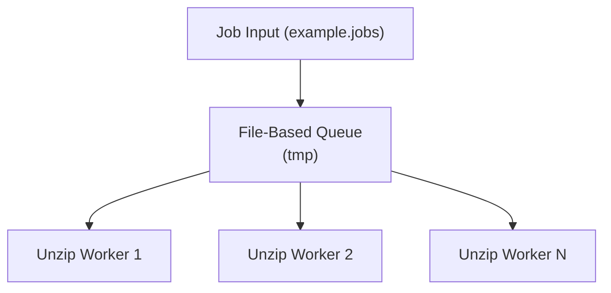
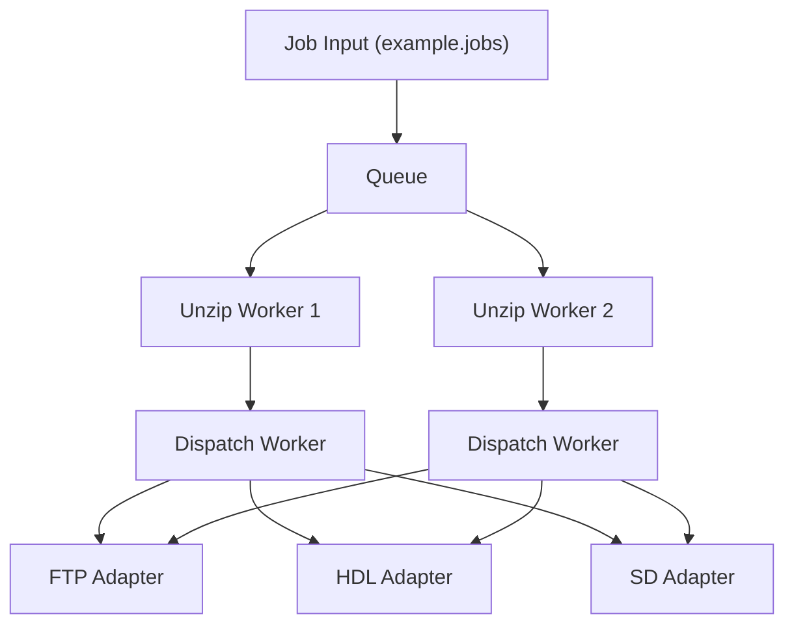
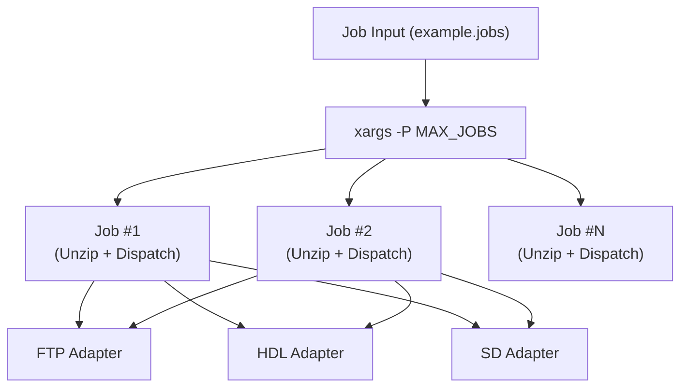
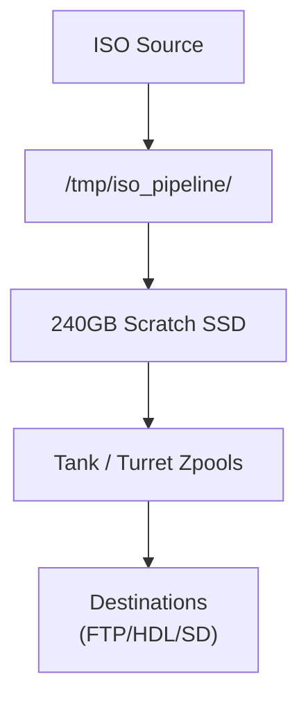

# loadout-pipeline Architecture

Complete architecture documentation for loadout-pipeline including queue management, worker modes, storage flows, and adapter system.

## Overview

**loadout-pipeline** is a space-aware, multithreaded ISO processing system that:
- Extracts ISO files from scratch storage
- Dispatches extracted contents to multiple destinations (FTP, HDL, SD)
- Manages concurrent operations without overwhelming scratch disk capacity
- Supports two processing modes: Classic (queue-based) and Xargs (parallel)

## Queue Architecture

The **file-based queue** is the central coordination point for space-aware processing. It:
- Stores pending jobs on scratch SSD (240GB)
- Maintains FIFO order for worker consumption
- Monitors disk space to prevent overflow
- Coordinates multiple unzip workers reading from the same queue
- Enables safe shutdown and job resumption

## Classic Worker Mode

Classic mode uses background workers that continuously process jobs from the queue:

1. **Unzip Workers** read from queue, extract ISOs to scratch SSD
2. **Dispatch Workers** move extracted files to configured destinations
3. **Queue Manager** tracks space and signals when new jobs can be processed

**Characteristics:**
- Stable throughput via space awareness
- Better for sustained, predictable workloads
- Complex shutdown/resume logic

## Xargs Multithreaded Mode

Xargs mode uses `xargs -P` for parallel job execution without an intermediate queue:

1. Job file is piped to `xargs`
2. Each parallel process unzips and dispatches immediately
3. No explicit queue or space awareness between jobs

**Characteristics:**
- Simpler implementation
- Fixed parallelism via `-P` flag
- Less sophisticated space management
- Better for ad-hoc or bursty workloads

## Adapter System

Dispatch workers send files to one of three destination adapters:

| Adapter | Method | Use Case |
|---------|--------|----------|
| **FTP** | Network transfer to remote FTP server | Remote backup / distribution |
| **HDL** | Local transfer via hdl_dump utility | Local HDD array / arcade systems |
| **SD** | Direct copy to mounted SD card | Portable storage / recovery media |

Each adapter handles:
- Connection validation
- Concurrent transfers (with per-adapter limits)
- Error handling and retry logic
- Space verification on destination

## Storage Architecture

- **Scratch SSD (240GB):** temporary extraction location, preventing large ISOs from consuming main storage
- **Zpools (Tank/Turret):** persistent storage for staging or archival
- **Destinations:** final delivery points via adapters

## Configuration & Modes

### Entry Point
- **Script:** `bin/loadout-pipeline.sh`
- **Job File Format:** each line = `directory~filename|destination`
  - Example: `games/sonic~sonic.iso|ftp,hdl,sd`

### Mode Selection
- **Classic Mode:** queue-based workers (default, recommended for stability)
- **Xargs Mode:** parallel jobs via `xargs -P` (simpler, use for smaller workloads)
- **Optional AI Worker:** preprocessing or metadata tagging (experimental)

## Optional Features

- **AI Worker:** optional preprocessing or metadata analysis before dispatch
- **Space Awareness:** limits concurrent unzips to prevent scratch overflow
- **Logging:** per-job output with configurable verbosity
- **Safe Shutdown:** queue persistence allows job resumption after restart

## Notes

- Job processing is FIFO within each mode
- Scratch SSD capacity acts as a backpressure mechanism
- Multiple adapters can be chained per job (comma-separated)
- Adapters run sequentially per dispatch worker to ensure order
