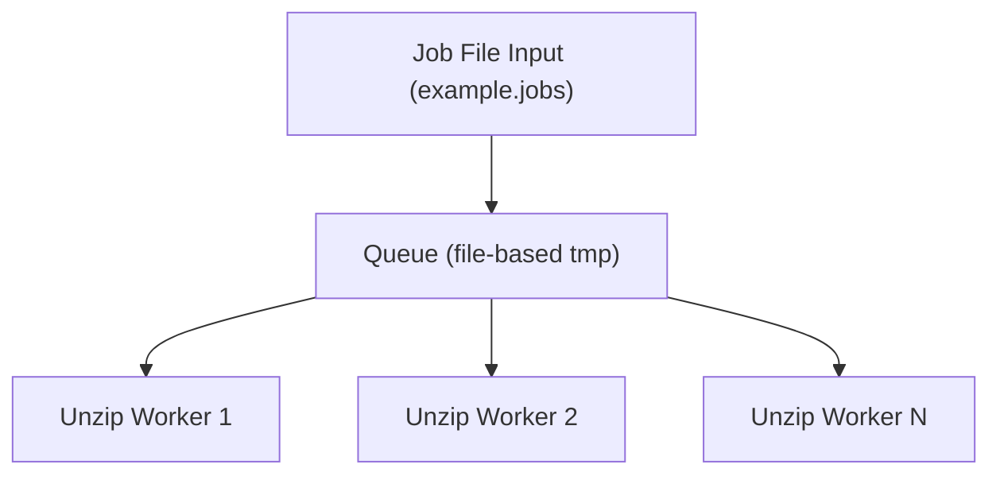
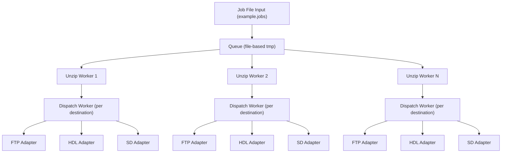
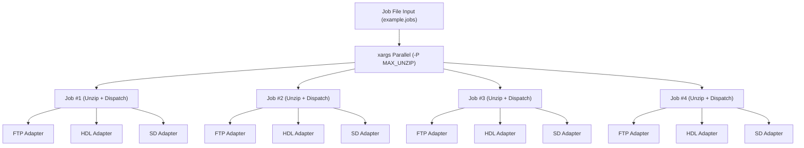
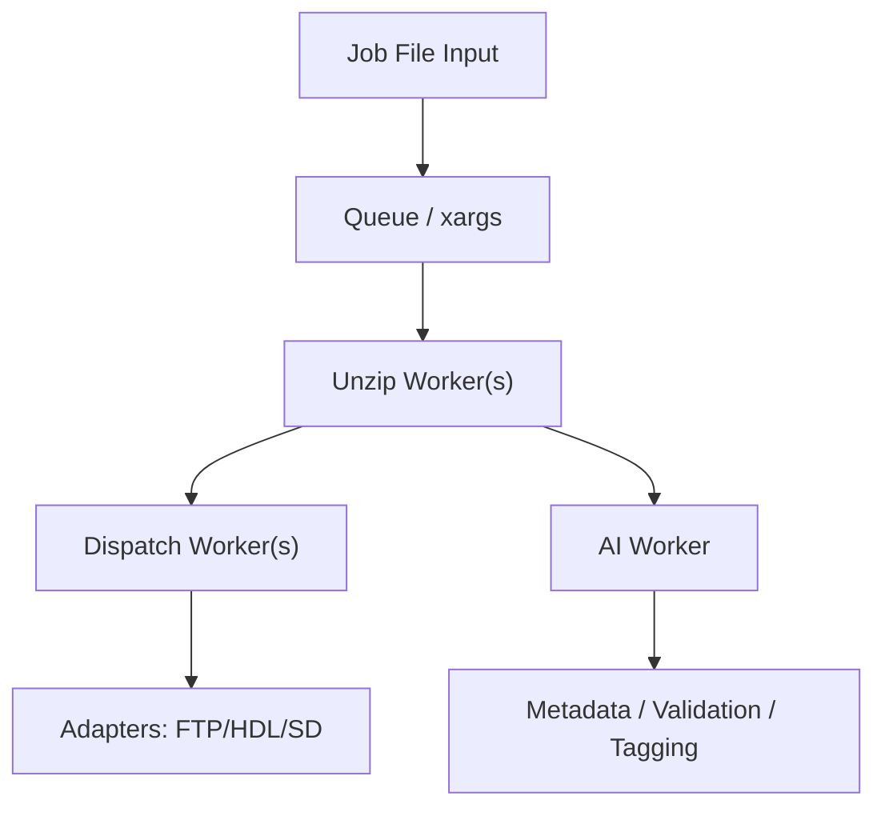
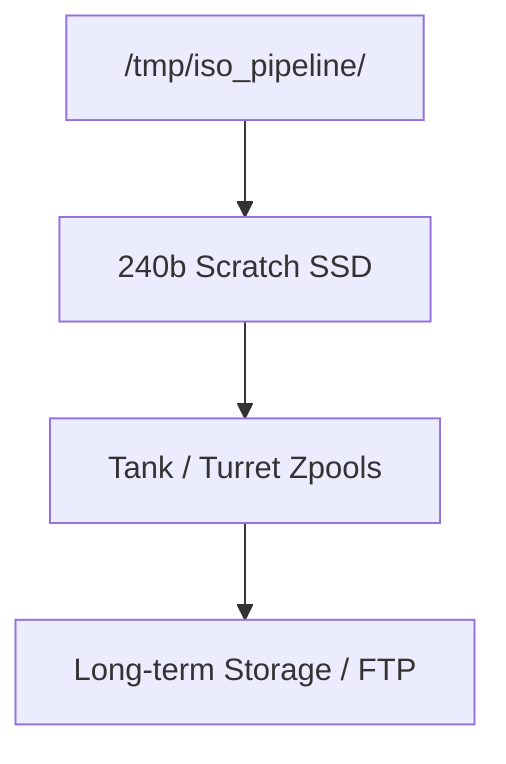
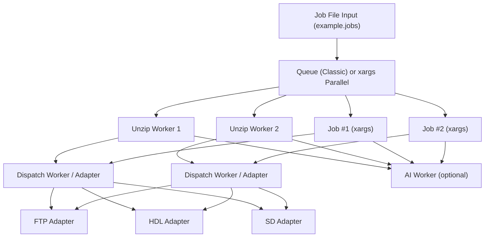

# iso-pipeline Architecture

Complete architecture documentation for iso-pipeline including queue, worker modes, AI integration, storage flows, and optional features.

## Queue Architecture

The **iso-pipeline queue** is the central component that controls **space-aware, multithreaded processing**. It sits between job input and unzip workers.

Key features:
- File-based queue on scratch SSD (240b) to avoid overfilling RAM
- FIFO processing for workers
- Space awareness: ensures scratch SSD does not exceed capacity
- Supports Classic Mode workers
- Optional AI Worker preprocessing
- Safe shutdown and resume for pending jobs

## Classic Worker Mode

Classic worker mode uses a file-based queue with multiple background unzip workers. Dispatch workers send files to FTP, HDL, or SD adapters. Queue ensures space-aware processing.

## Xargs Multithreaded Mode

Xargs mode uses `xargs -P` for parallel processing. Each job unzips and dispatches immediately without an intermediate queue.

## AI Worker Integration

AI Worker can preprocess or analyze files before dispatch, running in parallel or sequentially.

## Scratch Storage / ZPool Flow

ISOs are extracted on the 240b scratch SSD. Large or slow-moving storage resides in tank/turret zpools. Prevents overfilling scratch.

## Full Pipeline Overview

Full pipeline shows classic and xargs mode combined, with optional AI worker and all adapters.

## Workflow & Adapter Overview

The pipeline dispatch workers send unzipped ISOs to one of three adapters:
- **FTP Adapter:** sends files to remote FTP servers
- **HDL Adapter:** uses hdl_dump to move files to local HDD arrays
- **SD Adapter:** copies files to connected SD cards
Dispatch workers ensure that each destination receives files safely, respecting concurrency and disk space.

## Optional Features

- **Xargs Mode Toggle:** switch between classic queue workers and xargs multithreaded mode
- **AI Worker:** optional preprocessing or metadata tagging
- **Space Awareness:** limits number of unzipped files to avoid filling scratch SSD
- **Multithreading:** background workers or xargs jobs run concurrently to maximize throughput

## Notes / References

- Job file format: each line `directory~filename|destination`
- Scratch SSD (240b) is used for temporary extraction
- Tank / Turret Zpools store persistent or high-speed data
- Use the pipeline comparison table to choose the correct mode for your use case

## Pipeline Comparison Table

| Feature | Classic Worker Mode | Xargs Mode |
|---------|------------------|------------|
| Parallelism control | Background workers + wait | `xargs -P` |
| Queue / space awareness | Yes | Limited (manual checks possible) |
| Complexity | Medium | Low |
| Logging per job | Yes | Yes (stdout/stderr) |
| Ease of extension | High (workers + adapters) | Medium (single job wrapper) |
