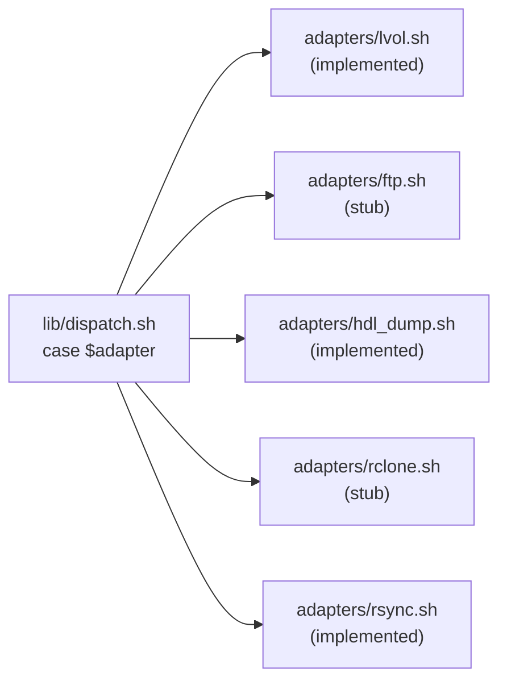

# Subsystem: Adapters

Adapters are the last-mile delivery stage. Each adapter is a
standalone script invoked by `lib/dispatch.sh` as
`bash adapters/<name>.sh <src> <dest>`. They receive a narrowed
environment (credential scoping is documented in
`extraction_pipeline.md#_build_strip_args`) and copy the extracted
content to its final destination.

Today three adapters are real (`lvol.sh`, `rsync.sh`, `hdl_dump.sh`)
and two are stubs (`ftp.sh`, `rclone.sh`). Stubs refuse by default
(`exit 1`) and succeed only when `ALLOW_STUB_ADAPTERS=1`. `hdl_dump.sh`
also honors `ALLOW_STUB_ADAPTERS=1` as a no-op escape hatch when the
`hdl_dump` binary is missing — this lets the unit suite run on
machines without PS2 tooling installed — but otherwise performs a
real inject.

## Shared adapter contract

Every adapter — real or stub — must obey the same interface:

**Invocation**
```
bash adapters/<name>.sh <src> <dest>
```

| Position | Name | Type          | Constraint                                        |
| -------: | ---- | ------------- | ------------------------------------------------- |
|       $1 | src  | absolute path | Extracted payload directory.                      |
|       $2 | dest | string        | Adapter-specific destination (from the job line). |

**Returns**:

|  rc | Meaning                                                           |
| --: | ----------------------------------------------------------------- |
| `0` | Transfer succeeded (or stub allowed via `ALLOW_STUB_ADAPTERS=1`). |
| `1` | Transfer failed, adapter not implemented, or validation refusal.  |

**Env dependencies**: adapter-specific (see per-adapter sections).
All adapters read `ROOT_DIR` for sourcing `lib/logging.sh`.

**Invariants shared across all adapters**

- Every adapter sources `lib/logging.sh` and runs under
  `set -euo pipefail`.
- **Content semantics**: adapters copy the **contents** of `$src`
  into `$dest` — not `$src` itself as a subdirectory. This matches
  the precheck convention where archive members are expected at
  `<dest>/<member>`, not at `<dest>/$(basename $src)/<member>`.
- Every adapter validates its arguments before mutating the
  destination.
- Adapter scripts are invoked via `env "${_strip_args[@]}" bash ...`
  from `dispatch.sh`, so only the adapter's own credentials are
  in the child's environment.

## Stub adapter contract

Applies to: `ftp.sh`, `rclone.sh`. (`hdl_dump.sh` is a real adapter;
see its contract below. It does honor `ALLOW_STUB_ADAPTERS=1` as a
binary-missing escape hatch, but that is not the full stub
contract — it only short-circuits when `hdl_dump` itself is
unavailable.)

**Test coverage**: `test/suites/20_unit_adapters_resume.sh` A1 (stub
refusal), `test/suites/07_adapters.sh` tests 16/17 (rclone/rsync
end-to-end wiring)

**Returns**:

|  rc | `ALLOW_STUB_ADAPTERS` | Behavior                                                    |
| --: | --------------------- | ----------------------------------------------------------- |
| `1` | unset or != `1`       | Refuses with `log_error` identifying the adapter as a stub. |
| `0` | `1`                   | Prints a `[<adapter>] STUB — would ...` line and succeeds.  |

**Invariants**

- Stubs must NOT silently succeed. Rationale: a real pipeline run
  would report "job completed" while nothing was actually
  transferred, and a subsequent re-run would re-extract every
  archive because the content still isn't at the destination.
- `ALLOW_STUB_ADAPTERS=1` is a test-convenience hook. It lets the
  test suite exercise the extract → dispatch → adapter wiring
  without requiring a real FTP server, HDD, remote, or host.
- The stub guard is the first logic after argument capture and
  `set -euo pipefail` — no filesystem mutation can occur before
  the guard runs.
- Replacing a stub with a real implementation is a drop-in change:
  remove the stub guard, implement the transfer, and preserve the
  rc=0/1 contract.

**Exemptions**: `ALLOW_STUB_ADAPTERS` is not frozen. The env var
name, default value, and per-stub log message may all change
without a migration note. The stub contract itself (refuse by
default, succeed on opt-in) is considered stable.

---

## Dispatch routing

`lib/dispatch.sh` routes each extracted job to exactly one adapter
script by `case`-matching on the `adapter` field of the job line:



---

### Script contract: `adapters/lvol.sh`

**Source**: `adapters/lvol.sh:1`
**Visibility**: script (invoked as `bash adapters/lvol.sh <src> <dest>`)
**Test coverage**: `test/suites/02_core_pipeline.sh` (end-to-end),
`test/suites/20_unit_adapters_resume.sh` A2 (missing mount), A3 (containment escape),
`test/suites/08_security.sh` (path-traversal)

**Invocation**
```
bash adapters/lvol.sh <src> <dest>
```

| Position | Name | Type          | Constraint                                  |
| -------: | ---- | ------------- | ------------------------------------------- |
|       $1 | src  | absolute path | Extracted payload directory (must exist).   |
|       $2 | dest | string        | Subdirectory path under `LVOL_MOUNT_POINT`. |

**Env dependencies**

| Var                | Required | Purpose                                                |
| ------------------ | -------- | ------------------------------------------------------ |
| `LVOL_MOUNT_POINT` | yes      | Destination root. Can be any writable local directory. |
| `ROOT_DIR`         | implicit | Derived from `$0` if unset.                            |

**Returns**:

|  rc | Meaning                                                                                                          |
| --: | ---------------------------------------------------------------------------------------------------------------- |
| `0` | Copy succeeded.                                                                                                  |
| `1` | Validation failure: src not found, mount point not set/missing/unwritable, containment escape, realpath missing. |

**Stdout**: `[lvol] Copying <src> → <target>` progress line.
**Stderr**: `log_error` on validation failure; `log_trace` on
entry/exit.

**Preconditions**

- `LVOL_MOUNT_POINT` is set, exists, and is writable.
- `$src` exists as a directory.
- `realpath` is on `$PATH` (**mandatory** — no fallback).

**Postconditions (on rc=0)**

- `$LVOL_MOUNT_POINT/$dest/` exists and contains the contents of
  `$src`.
- Pre-existing files at the destination are overwritten if rsync
  determines they differ (size + modtime); otherwise left untouched.

**Invariants**

- **Containment check is mandatory**. If `realpath` is not
  available, the adapter refuses to proceed with `exit 1`.
  Rationale: without `realpath -m`, a jobs file with
  `dest="../../etc/cron.d"` would silently overwrite arbitrary
  filesystem locations. Failing hard is safer than degrading to
  no check.
- Canonicalization uses `realpath -m` (the `-m` flag accepts
  paths whose tail does not yet exist). Both `$target` and
  `$mount_point` are canonicalized before the prefix match.
- The trailing `/` in the `case` pattern prevents
  `$mount_point/games` from matching `$mount_point/games_extra`.
- **Copy strategy**: rsync is preferred when available; `cp -r` is
  the fallback. Both copy the **contents** of `$src` into
  `$target`, not `$src` itself as a subdirectory.
  - rsync: trailing slash on `$src/` → content copy. Skips
    identical files (size + modtime).
  - cp: `$src/.` → content copy (POSIX-portable for "contents of
    this directory").
- Path normalization strips trailing `/` from mount point and
  leading `/` from dest so the join is always a clean single-slash
  separator (`${mount_point}/${dest_clean}`).
- Validation order: src exists → mount point set → mount point
  exists → mount point writable → realpath available →
  containment → copy. This order ensures the cheapest checks
  run first and the most informative error messages surface.

**Side effects**

- Creates `$target` via `mkdir -p` if needed.
- Copies (rsync or cp) the contents of `$src` into `$target`.

**Error modes**

| rc | Condition              | Characteristic stderr                                                            |
| --: | ---------------------- | -------------------------------------------------------------------------------- |
|  1 | src not found          | `lvol: source directory does not exist: <src>`                                   |
|  1 | mount point unset      | `lvol: LVOL_MOUNT_POINT is not set`                                              |
|  1 | mount point missing    | `lvol: LVOL_MOUNT_POINT does not exist: <path>`                                  |
|  1 | mount point unwritable | `lvol: LVOL_MOUNT_POINT is not writable: <path>`                                 |
|  1 | realpath missing       | `lvol: realpath not found — containment check is mandatory, refusing to proceed` |
|  1 | containment escape     | `lvol: destination escapes LVOL_MOUNT_POINT` + resolved paths                    |

**Example**
```bash
LVOL_MOUNT_POINT=/mnt/lvol bash adapters/lvol.sh /tmp/extract/game1 games/game1
```

**Exemptions**: none. All behavior documented here is frozen.

---

### Script contract: `adapters/ftp.sh`

**Source**: `adapters/ftp.sh:1`
**Visibility**: script (stub)
**Test coverage**: `test/suites/20_unit_adapters_resume.sh` A1

**Invocation**
```
bash adapters/ftp.sh <src> <dest>
```

**Env dependencies**

| Var                   | Required      | Purpose                           |
| --------------------- | ------------- | --------------------------------- |
| `FTP_HOST`            | for real impl | FTP server hostname.              |
| `FTP_USER`            | for real impl | FTP username.                     |
| `FTP_PASS`            | for real impl | FTP password.                     |
| `FTP_PORT`            | optional      | FTP port (default: 21).           |
| `ALLOW_STUB_ADAPTERS` | for stub      | Set to `1` to allow stub success. |

See **stub adapter contract** above for behavior.

**Exemptions**: entire script is not frozen — replacing the stub
with a real implementation is expected.

---

### Script contract: `adapters/hdl_dump.sh`

**Source**: `adapters/hdl_dump.sh:1`
**Visibility**: script (implemented)
**Test coverage**: `test/integration/suites/07_adapters.sh` Test 15 / 15b

**Invocation**
```
bash adapters/hdl_dump.sh <src> <dest>
```

`<src>` is the extracted ISO directory. `<dest>` is the combined
2-part string `<cd|dvd>|<title>` assembled by `lib/dispatch.sh` from
fields 3–4 of the 4-field hdl job line (`~<iso>|hdl|<cd|dvd>|<title>~`).
The adapter splits it back out via `parse_hdl_destination` (see
`lib/job_format.sh`). The PS2 device designators are not part of the
job line — they are carried in the `HDL_HOST_DEVICE` and
`HDL_INSTALL_TARGET` environment variables so every hdl job in a
batch targets the same HDD under operator control.

**Behavior**

1. Validates `<src>` is a directory.
2. Calls `parse_hdl_destination "$dest"` to recover `format` / `title`.
3. Requires `HDL_INSTALL_TARGET` to be non-empty (the inject target,
   e.g. `hdd0:`). Fails with a clear error message if unset.
4. Selects the injection image based on `<format>`:
   - **`dvd`** → `inject_dvd`. Requires exactly one `*.iso` under
     `<src>` and rejects any `*.cue`/`*.bin` (PS2 DVD dumps are always
     single-track ISO 9660).
   - **`cd`** → `inject_cd`. Prefers a `*.cue` if present — `hdl_dump`
     reads the cue and resolves its `*.bin` track references itself.
     If no cue, falls back to a single `*.iso`. Rejects archives
     that contain both a `*.cue` and a `*.iso` (ambiguous), and
     rejects orphaned `*.bin` with no `*.cue` manifest.
   - 0 matches, >1 matches of the chosen type, or a mixed/ambiguous
     archive all fail loudly — matches the lvol wrapper-flatten
     strictness. The operator must split multi-image archives into
     separate jobs.
5. Runs `"$HDL_DUMP_BIN" <inject_cmd> "$HDL_INSTALL_TARGET" "<title>"
   "<image>"` where `<image>` is the `*.iso` or `*.cue` chosen in
   step 4. Device resolution (`<target>:` → host path) is delegated
   to the operator's real `~/.hdl_dump.conf` — the adapter does not
   touch `HOME`, mint scratch configs, or mirror upstream's
   config-file format.
6. On missing `hdl_dump` binary, honors `ALLOW_STUB_ADAPTERS=1` as a
   no-op escape hatch (used by the unit suite on machines without
   `hdl_dump` installed); otherwise fails. The stub-escape branch runs
   before the `HDL_INSTALL_TARGET` check so the unit suite does not
   need to export the env var just to hit the no-op path.

**Env dependencies**

| Var                   | Required | Purpose                                                                                                                           |
| --------------------- | -------- | --------------------------------------------------------------------------------------------------------------------------------- |
| `HDL_DUMP_BIN`        | yes      | Path to the `hdl_dump` binary. Defaults to `hdl_dump` (PATH lookup).                                                              |
| `HDL_INSTALL_TARGET`  | yes      | Per-inject target passed to `hdl_dump` (e.g. `hdd0:`). Resolved via `~/.hdl_dump.conf`.                                           |
| `HDL_HOST_DEVICE`     | no       | Startup-probe target checked by `bin/loadout-pipeline.sh` (e.g. `sri:`); empty skips the probe. Not read by this script directly. |
| `ALLOW_STUB_ADAPTERS` | no       | Set to `1` to no-op when `hdl_dump` is missing — test scaffolding only.                                                           |

**Rationale for env-var targets**: `hdl_dump` addresses PS2 HDDs by
logical id (`hdd0:`, `sri:`, …), which it resolves to host paths via
`$HOME/.hdl_dump.conf`. Every job in a batch runs against the same
physical HDD, so the target belongs to the operator/wrapper rather
than to each `.jobs` line. Pushing the designator into env vars keeps
the job-line grammar short, avoids duplicating the same value across
dozens of rows, and lets the adapter reuse the operator's real
`~/.hdl_dump.conf` without rewriting `HOME` or synthesizing a
per-job config.

**Exemptions**: none — the adapter is frozen under the normal 2-arg
adapter contract. Its `dest` parsing is covered by
`parse_hdl_destination` unit tests in suite 14.

---

### Script contract: `adapters/rclone.sh`

**Source**: `adapters/rclone.sh:1`
**Visibility**: script (stub)
**Test coverage**: `test/suites/20_unit_adapters_resume.sh` A1,
`test/suites/07_adapters.sh` test 16 (end-to-end wiring)

**Invocation**
```
bash adapters/rclone.sh <src> <dest>
```

**Env dependencies**

| Var                   | Required      | Purpose                                    |
| --------------------- | ------------- | ------------------------------------------ |
| `RCLONE_REMOTE`       | for real impl | Rclone remote name + optional bucket/root. |
| `RCLONE_DEST_BASE`    | optional      | Base path appended after the remote.       |
| `RCLONE_FLAGS`        | optional      | Extra flags forwarded verbatim.            |
| `ALLOW_STUB_ADAPTERS` | for stub      | Set to `1` to allow stub success.          |

See **stub adapter contract** above for behavior.

**Exemptions**: entire script is not frozen — replacing the stub
with a real implementation is expected.

---

### Script contract: `adapters/rsync.sh`

**Source**: `adapters/rsync.sh:1`
**Visibility**: script (invoked as `bash adapters/rsync.sh <src> <dest>`)
**Test coverage**: `test/suites/07_adapters.sh` tests 17a–17c
(local transfer, idempotent re-run, containment escape)

**Invocation**
```
bash adapters/rsync.sh <src> <dest>
```

| Position | Name | Type          | Constraint                                 |
| -------: | ---- | ------------- | ------------------------------------------ |
|       $1 | src  | absolute path | Extracted payload directory (must exist).  |
|       $2 | dest | string        | Subdirectory path under `RSYNC_DEST_BASE`. |

**Env dependencies**

| Var               | Required | Purpose                                      |
| ----------------- | -------- | -------------------------------------------- |
| `RSYNC_DEST_BASE` | yes      | Base path on the target.                     |
| `RSYNC_HOST`      | optional | Remote hostname; omit for local transfer.    |
| `RSYNC_USER`      | optional | SSH username for remote transfers.           |
| `RSYNC_SSH_PORT`  | optional | SSH port (default: 22).                      |
| `RSYNC_FLAGS`     | optional | Extra flags forwarded verbatim (word-split). |
| `ROOT_DIR`        | implicit | Derived from `$0` if unset.                  |

**Returns**:

|  rc | Meaning                            |
| --: | ---------------------------------- |
| `0` | Transfer succeeded.                |
| `1` | Validation failure or rsync error. |

**Stdout**: `[rsync] Transferring <src> → <target>` progress line.
**Stderr**: `log_error` on validation failure; `log_trace` on
entry/exit.

**Preconditions**

- `RSYNC_DEST_BASE` is set.
- `$src` exists as a directory.
- `rsync` is on `$PATH`.
- For local transfers: `realpath` is on `$PATH` (**mandatory**).

**Postconditions (on rc=0)**

- `$RSYNC_DEST_BASE/$dest/` exists and contains the contents of
  `$src`.
- Pre-existing files at the destination are skipped if their
  checksums match (`-c` flag); otherwise overwritten.

**Transfer strategy**

Base flags: `-avzc --partial --append-verify --info=progress2`

- `-c` (checksum-based skip) is critical: re-extraction via
  `7z x -aoa` changes file mtimes, so rsync's default size+mtime
  skip would re-transfer everything on a re-run.
- `--partial` keeps incomplete files for later resumption.
- `--append-verify` resumes partial files and checksums the result.
- No `--delete` — one game dir dispatched at a time, nothing stale.

**Local vs remote**

- **Local** (no `RSYNC_HOST`): containment check via `realpath -m`
  prevents `../` escapes, `mkdir -p` creates target, rsync
  transfers contents.
- **Remote** (with `RSYNC_HOST`): SSH transport with configurable
  port via `RSYNC_SSH_PORT`, `--mkpath` creates remote
  directories (rsync 3.2.3+), no containment check (SSH user
  permissions are the containment boundary).

**Invariants**

- **Containment check is mandatory for local transfers**. If
  `realpath` is not available, the adapter refuses to proceed.
- Canonicalization uses `realpath -m` (accepts paths whose tail
  does not yet exist).
- The trailing `/` in the `case` pattern prevents false prefix
  matches.
- `RSYNC_FLAGS` is intentionally unquoted to allow word splitting
  so multi-flag strings like `"--bwlimit=1000 --compress-level=9"`
  expand to separate arguments.
- Path normalization strips trailing `/` from dest base and
  leading `/` from dest for clean single-slash join.

**Error modes**

| rc | Condition                  | Characteristic stderr                                         |
| --: | -------------------------- | ------------------------------------------------------------- |
|  1 | src not found              | `rsync: source directory does not exist: <src>`               |
|  1 | RSYNC_DEST_BASE unset      | `rsync: RSYNC_DEST_BASE is not set`                           |
|  1 | rsync not on PATH          | `rsync: rsync command not found on PATH`                      |
|  1 | realpath missing (local)   | `rsync: realpath not found — containment check is mandatory`  |
|  1 | containment escape (local) | `rsync: destination escapes RSYNC_DEST_BASE` + resolved paths |

**Example**
```bash
# Local transfer
RSYNC_DEST_BASE=/mnt/nas bash adapters/rsync.sh /tmp/extract/game1 games/game1

# Remote transfer
RSYNC_DEST_BASE=/mnt/nas RSYNC_HOST=nas.local RSYNC_USER=admin \
    bash adapters/rsync.sh /tmp/extract/game1 games/game1
```

**Exemptions**: none. All behavior documented here is frozen.
