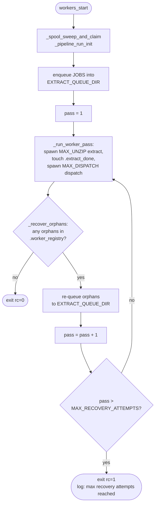

# Subsystem: Workers & Orchestration

`lib/workers.sh` is the concurrency core — two worker pools draining
two queues:

```
EXTRACT_QUEUE_DIR  ── MAX_UNZIP extract workers ──┐
                                                   ▼
                                     lib/extract.sh (precheck → reserve → copy → 7z x)
                                                   │
                                                   ▼
DISPATCH_QUEUE_DIR ── MAX_DISPATCH dispatch workers ─→ lib/dispatch.sh → adapter
```

The two pools run concurrently: dispatch of job N overlaps extraction
of job N+1. Dispatch workers poll with exponential backoff and exit
once `.extract_done` appears AND the dispatch queue drains.

Recovery: after each pass, `_recover_orphans` reads the worker
registry. Jobs still listed there belonged to a SIGKILL'd worker and
are re-queued onto the extract queue for another pass. The recovery
loop terminates when `MAX_RECOVERY_ATTEMPTS` passes run without
producing new orphans, or when `_recover_orphans` returns 1 (empty
registry).



### `_spool_sweep_and_claim`

**Source**: `lib/workers.sh:56`
**Visibility**: private
**Test coverage**: `test/suites/04_failure_handling.sh` (indirect, end-to-end); direct assertions not currently present.

**Signature**
```
_spool_sweep_and_claim
```

Takes no arguments.

**Returns**: `0` always.
**Stdout**: silent.
**Stderr**: silent on success.

**Preconditions**

- `$COPY_DIR` is set.
- `_spool_guarded_rm_rf` is defined (same file).

**Postconditions**

- `$COPY_SPOOL` is exported and points to `$COPY_DIR/$$`.
- `$COPY_SPOOL` exists as an empty directory.
- Any sibling subdirectory under `$COPY_DIR` whose name is a numeric
  PID no longer passing `kill -0` has been removed.

**Invariants**

- Must run **before** `$COPY_SPOOL` is created. Otherwise the `kill -0 $$`
  check for the current process would classify the new directory
  as "still alive" — correct — but it would also have to be
  handled separately in the sweep logic. Running the sweep first
  keeps the loop body identical for every subdir and leaves the
  `mkdir -p "$COPY_SPOOL"` at the end as the unambiguous claim.
- PID-wraparound defence: the sweep skips directories whose numeric
  name passes `kill -0`, but on a reused PID that directory might
  belong to a crashed previous run. The unconditional
  `_spool_guarded_rm_rf "$COPY_SPOOL"` before the final `mkdir -p`
  guarantees a clean spool even when `$$` happens to match a
  leftover subdir.
- Only **direct** subdirectories of `$COPY_DIR` are swept
  (`-mindepth 1 -maxdepth 1`). Anything deeper (e.g. per-job
  extract directories inside the spool) is left to individual
  workers.
- Only subdirs whose basename is purely numeric are candidates.
  Anything else (e.g. a `.lost+found` or a stray text file) is
  preserved.

**Side effects**

- Exports `$COPY_SPOOL`.
- May delete sibling subdirs under `$COPY_DIR` via `_spool_guarded_rm_rf`.
- Creates `$COPY_SPOOL` as an empty directory.

**Error modes**: a `rm -rf` failure is caught by
`_spool_guarded_rm_rf`'s own rc check; in practice this helper is
always successful on a well-formed spool layout.

**Example**
```bash
# Called at the top of workers_start:
_spool_sweep_and_claim
```

### `_spool_guarded_rm_rf`

**Source**: `lib/workers.sh:89`
**Visibility**: private
**Test coverage**: `test/suites/15_unit_runtime.sh` R3

**Signature**
```
_spool_guarded_rm_rf <path>
```

| Position | Name | Type          | Constraint                                                                                 |
| -------: | ---- | ------------- | ------------------------------------------------------------------------------------------ |
|       $1 | path | absolute path | Should point at a subdirectory directly under `$COPY_DIR` whose basename is a numeric PID. |

**Returns**:

|       rc | Meaning                                                                                        |
| -------: | ---------------------------------------------------------------------------------------------- |
|      `0` | Removed the path, or the path was `""` / `/` / `.` and refused (the refusal itself is logged). |
|      `1` | The path failed the guard check (wrong parent or non-numeric basename).                        |
| non-zero | The inner `rm -rf` failed.                                                                     |

**Stdout**: silent.
**Stderr**: On refusal, one or two `log_error` lines describing the
guard that fired.

**Preconditions**: `$COPY_DIR` is set.

**Postconditions (on rc=0)**: the path no longer exists (unless the
refuse-on-empty branch fired, in which case nothing changed).

**Invariants**

- Refuses to touch `""`, `/`, or `.` outright. These are all
  high-blast-radius typos.
- Refuses any path whose direct parent is not `$COPY_DIR`. A
  crafted `$COPY_SPOOL=/etc` would therefore get bounced with a
  logged error rather than producing a destructive rm.
- Refuses any path whose basename is not a purely-numeric string.
  Spool subdirs are always named after `$$`, so this guard catches
  anything inherited from a misconfigured env var or a corrupted
  value.
- The guard list (empty / root / dot, parent mismatch, non-numeric
  name) is the complete refuse set. Suite 15 R3 pins every branch.
- Successful removals are silent — the helper is called from
  cleanup paths and should not noise the log on the happy path.

**Side effects**

- On rc=0 (path passed guards), `rm -rf -- "$path"`.

**Error modes**

| rc | Condition                                      | Characteristic stderr                                                                     |
| --: | ---------------------------------------------- | ----------------------------------------------------------------------------------------- |
|  1 | `path` empty/`/`/`.`                           | `spool guard: refusing to rm '<path>'`                                                    |
|  1 | Parent not `$COPY_DIR` or non-numeric basename | `spool guard: refusing rm of '<path>' (parent='<p>' name='<n>' not under COPY_DIR/<pid>)` |

**Example**
```bash
trap "_spool_guarded_rm_rf '$COPY_SPOOL'" EXIT
```

### `_pipeline_run_init`

**Source**: `lib/workers.sh:126`
**Visibility**: private
**Test coverage**: indirect via end-to-end `test/suites/02_core_pipeline.sh`; no direct assertion.

**Signature**
```
_pipeline_run_init
```

Takes no arguments.

**Returns**: `0` always.
**Stdout**: silent.
**Stderr**: silent.

**Preconditions**

- `$EXTRACT_QUEUE_DIR`, `$DISPATCH_QUEUE_DIR`, `$QUEUE_DIR`,
  `$ROOT_DIR` are all set.
- `queue_init` is available (sourced via `bin/loadout-pipeline.sh`).

**Postconditions**

- Both sub-queues exist and are empty of `.job` / `.claimed.*`.
- `$QUEUE_DIR/.extract_done` does not exist.
- The space ledger and its lock file are empty.
- The worker registry and its lock file are empty.
- `lib/space.sh` and `lib/worker_registry.sh` have been sourced in
  the current shell, so their functions are inherited by every
  forked worker subshell.

**Invariants**

- The sources happen **inside** this helper, not at the top of the
  file. This is deliberate: the helper runs once per pipeline run,
  and sourcing on every run keeps the initialisation order
  consistent even if a future extension ever needs to reload the
  space ledger between passes.
- `space_init` and `worker_registry_init` are called **after**
  their respective source, so the correct functions are in scope.

**Side effects**

- Truncates / re-creates queue, ledger, registry files.
- Sources two library files in the current shell.

**Error modes**: none in normal use.

**Example**
```bash
# Inside workers_start, right after _spool_sweep_and_claim:
_pipeline_run_init
```

### `_run_worker_pass`

**Source**: `lib/workers.sh:177`
**Visibility**: private
**Test coverage**: indirect via `test/suites/04_failure_handling.sh` and `test/suites/02_core_pipeline.sh`.

**Signature**
```
_run_worker_pass <pass_num> <nameref_rc>
```

| Position | Name       | Type          | Constraint                                                                                                                         |
| -------: | ---------- | ------------- | ---------------------------------------------------------------------------------------------------------------------------------- |
|       $1 | pass_num   | integer       | 1-based. Pass 1 prints a "Starting N workers" banner; later passes print a recovery banner.                                        |
|       $2 | nameref_rc | variable name | Name of the caller's integer variable to be set via `local -n`. Written to `1` if any worker exits non-zero; otherwise left alone. |

**Returns**: `0` always (failures are communicated via the nameref).
**Stdout**: one line — either the "Starting N worker(s)..." or the
"Recovery pass N: restarting workers..." banner.
**Stderr**: silent on the happy path.

**Preconditions**

- `$MAX_UNZIP`, `$MAX_DISPATCH`, `$QUEUE_DIR`, `$DISPATCH_QUEUE_DIR`
  are set.
- `unzip_worker` and `dispatch_worker` are defined.
- The extract queue has been populated by the caller.

**Postconditions**

- `$MAX_UNZIP` extract workers have been forked and waited on.
- After extract workers finish, `$QUEUE_DIR/.extract_done` has been
  touched to signal dispatch workers to drain and exit.
- `$MAX_DISPATCH` dispatch workers have been forked and waited on.
- `$QUEUE_DIR/.extract_done` has been removed.
- `$DISPATCH_QUEUE_DIR` has been `queue_init`-ed to clear any
  leftover `.claimed.*` files before a possible recovery pass.

**Invariants**

- Each worker PID is **waited on individually**. `wait` with no
  arguments would wait for any child, but would lose per-child exit
  status. The loop collects `|| _pass_rc=1` from each wait so a
  SIGKILL'd child surfaces as `pass_rc=1` for the caller.
- `touch "$QUEUE_DIR/.extract_done"` fires **after** the extract
  wait loop. Dispatch workers poll for this sentinel and exit once
  it exists AND their queue is empty. A premature touch would cause
  dispatch workers to exit while extract workers are still writing
  new dispatch jobs.
- The final `queue_init "$DISPATCH_QUEUE_DIR"` is load-bearing for
  recovery: on a pass where some dispatch workers died holding
  `.claimed.*` files, `queue_init` removes them so the next pass
  starts clean.

**Side effects**

- Forks `MAX_UNZIP + MAX_DISPATCH` background processes.
- Writes `$QUEUE_DIR/.extract_done` and then removes it.
- Resets `$DISPATCH_QUEUE_DIR`.

**Error modes**: any worker exit non-zero sets `pass_rc=1`.

**Example**
```bash
local rc=0 pass_rc=0
_run_worker_pass 1 pass_rc
rc=$pass_rc
```

### `_recover_orphans`

**Source**: `lib/workers.sh:242`
**Visibility**: private
**Test coverage**: `test/suites/04_failure_handling.sh`, `test/suites/06_worker_registry.sh`

**Signature**
```
_recover_orphans
```

Takes no arguments.

**Returns**:

|  rc | Meaning                                                                              |
| --: | ------------------------------------------------------------------------------------ |
| `0` | One or more orphans were found and re-queued. Caller should run another worker pass. |
| `1` | No orphans. Caller should break out of the recovery loop.                            |

**Stdout**: silent.
**Stderr**: On orphans found, a single `log_warn` line: `<N> orphaned job(s) detected — re-queuing for recovery`.

**Preconditions**

- `worker_registry_recover` is available (sourced by
  `_pipeline_run_init`).
- `queue_push` is available.

**Postconditions (rc=0)**

- `$QUEUE_DIR/.worker_registry` has been truncated.
- Every orphan has been re-pushed onto `$EXTRACT_QUEUE_DIR` as a
  new `.job` file.

**Postconditions (rc=1)**

- `$QUEUE_DIR/.worker_registry` has been truncated (it was already
  empty).

**Invariants**

- Orphans are first collected into a local array, then re-pushed.
  The two-phase read-then-push avoids any interaction between the
  registry read and the queue push — a concurrent worker begin
  would be impossible anyway (the recovery path runs between
  passes, after all workers have exited), but the two-phase pattern
  makes the data flow auditable.
- The warn message is fired once per recovery, not once per
  orphan, to keep the log skimmable.

**Side effects**

- Reads the registry via `worker_registry_recover` (which truncates
  it as a side effect).
- Pushes orphans onto the extract queue.

**Error modes**: none.

**Example**
```bash
_recover_orphans || break
```

### `workers_start`

**Source**: `lib/workers.sh:301`
**Visibility**: public
**Test coverage**: `test/suites/02_core_pipeline.sh` (end-to-end), `test/suites/04_failure_handling.sh`, `test/suites/12_resume_planner.sh`

**Signature**
```
workers_start
```

Takes no arguments.

**Returns**:

|  rc | Meaning                                                                                                       |
| --: | ------------------------------------------------------------------------------------------------------------- |
| `0` | Every job completed successfully across every pass.                                                           |
| `1` | One or more jobs failed permanently (extract error, oversized archive, or `MAX_RECOVERY_ATTEMPTS` exhausted). |

**Stdout**: progress banners via `_run_worker_pass`.
**Stderr**: `log_error` on orphan-exhaustion or final non-zero rc.

**Preconditions**

- The global `JOBS` array has been populated by `load_jobs`.
- All config env vars are set (guaranteed by `lib/config.sh`).
- `log_enter`, `log_error`, `log_warn` are defined.

**Postconditions**

- `$COPY_SPOOL` has been claimed, used, and removed (via the EXIT
  trap).
- Both sub-queues are empty (drained).
- The space ledger and worker registry are empty.
- Every completed job's extract directory has been consumed by
  dispatch (via the `_dispatch_handle_job` side effects, not by
  this function directly).

**Invariants**

- EXIT trap with early-expanded `$COPY_SPOOL` so a Ctrl-C between
  passes still cleans up the spool. `shellcheck SC2064` is
  disabled on that line intentionally — the early expansion is the
  point, not a bug.
- `resume_plan` is called **before** the enqueue loop so already-satisfied
  jobs never hit the queue. `resume_plan` mutates the
  global `JOBS` array in place; the enqueue loop that follows
  reads the filtered array.
- Per-pass `pass_rc=0` reset: a clean recovery pass must not
  inherit the prior SIGKILL pass's `pass_rc=1`. The final `rc`
  reflects the **last** pass that ran — i.e. "did we eventually
  finish cleanly?" — unless `MAX_RECOVERY_ATTEMPTS` is exceeded,
  which is forced to rc=1.
- `pass++` uses the `|| true` dance because `set -e` would abort
  on the post-increment returning the prior value when that value
  is zero (a classic bash gotcha).
- Recovery loop terminates via `_recover_orphans || break`:
  rc=1 (no orphans) breaks out of the `while true`. Otherwise the
  loop runs at most `max_recovery` extra passes before a hard
  failure.

**Side effects**

- Installs an EXIT trap for spool cleanup.
- Pushes every job onto the extract queue.
- Forks workers via nested helpers.

**Error modes**

| rc | Condition                                | Characteristic stderr                                                  |
| --: | ---------------------------------------- | ---------------------------------------------------------------------- |
|  1 | A worker reported a permanent failure    | `one or more workers reported failures`                                |
|  1 | `pass > max_recovery` and orphans remain | `max recovery attempts (<n>) reached; some jobs permanently abandoned` |

**Example**
```bash
# Inside bin/loadout-pipeline.sh:
log_info "Starting pipeline..."
workers_start
log_info "All jobs completed!"
```

### `_unzip_handle_job`

**Source**: `lib/workers.sh:397`
**Visibility**: private
**Test coverage**: `test/suites/04_failure_handling.sh` (SIGKILL recovery), `test/suites/05_space_ledger.sh` (space-retry backoff)

**Signature**
```
_unzip_handle_job <job> <backoff_nameref>
```

| Position | Name            | Type          | Constraint                                                                                                          |
| -------: | --------------- | ------------- | ------------------------------------------------------------------------------------------------------------------- |
|       $1 | job             | string        | Full job line including `~`.                                                                                        |
|       $2 | backoff_nameref | variable name | Name of the caller's associative array (declared `declare -A`) mapping job strings to their current sleep interval. |

**Returns**:

|   rc | Meaning                                                                                                                 |
| ---: | ----------------------------------------------------------------------------------------------------------------------- |
|  `0` | `lib/extract.sh` completed cleanly.                                                                                     |
| `75` | Space did not fit; job was re-queued. Caller must **not** count this as a failure.                                      |
|  `1` | Permanent failure: extract rc other than 0/75, **or** rc=75 with an empty live ledger (archive too big for filesystem). |

**Stdout**: silent.
**Stderr**: `log_error` on permanent failure; `log_debug` on each
space-retry re-queue.

**Preconditions**

- `space_ledger_empty` is in scope (sourced via `_pipeline_run_init`).
- `queue_push`, `awk`, `sleep` are available.
- `$SPACE_RETRY_BACKOFF_INITIAL_SEC` and
  `$SPACE_RETRY_BACKOFF_MAX_SEC` are set (defaults 5 and 60).

**Postconditions (rc=0)**: the job has been extracted and a dispatch
token has been pushed onto `$DISPATCH_QUEUE_DIR` (by `extract.sh`,
not by this helper).

**Postconditions (rc=75)**:

- The job has been re-pushed onto `$EXTRACT_QUEUE_DIR`.
- The caller's backoff map for this job has been updated to the
  next doubled interval, capped at `$SPACE_RETRY_BACKOFF_MAX_SEC`.
- Worker has slept for the **current** (pre-doubled) backoff.

**Postconditions (rc=1)**

- Either `extract.sh` exited non-zero and non-75 (hard failure), or
  `space_ledger_empty` was true when the reservation missed (the
  archive will never fit).

**Invariants**

- The fast-fail branch (`space_ledger_empty`) is critical: without
  it, a worker that lost the race for space would sleep, re-queue,
  pop itself again, lose again, and livelock forever. The ledger
  being empty means no sibling holds space, so retrying cannot
  help and giving up is correct.
- Backoff doubles on each consecutive miss, but only for **this
  worker's** lifetime — the map is local to `unzip_worker`. A
  different worker that picks up the same job starts from
  `SPACE_RETRY_BACKOFF_INITIAL_SEC` again.
- The doubling is computed with `awk` because
  `SPACE_RETRY_BACKOFF_INITIAL_SEC` allows decimals (`0.5`),
  which bash arithmetic expansion does not handle.
- `log_debug` is used for the "sleeping Ns" message, not
  `log_info`. This is so the compat-pinned grep target
  `"space reservation miss"` is emitted exactly once per miss on
  stderr and never on stdout.

**Side effects**

- Forks `bash "$ROOT_DIR/lib/extract.sh" "$job"`.
- On rc=75 non-livelock path: sleeps, pushes to the queue, updates
  the backoff map.
- On rc=75 livelock path: `log_error` only, no sleep.

**Error modes**

| rc | Condition                    | Characteristic stderr                                                                                                              |
| --: | ---------------------------- | ---------------------------------------------------------------------------------------------------------------------------------- |
|  1 | `extract.sh` rc not 0/75     | `extract failed (rc=<n>): <job>`                                                                                                   |
|  1 | rc=75 with empty live ledger | `extract: archive does not fit in scratch space and no siblings are running — archive may be too large for this filesystem: <job>` |

**Example**
```bash
declare -A backoff=()
_unzip_handle_job "$job" backoff
```

### `unzip_worker`

**Source**: `lib/workers.sh:483`
**Visibility**: public (called by `_run_worker_pass` via `&`)
**Test coverage**: `test/suites/02_core_pipeline.sh`, `test/suites/04_failure_handling.sh`, `test/suites/05_space_ledger.sh`

**Signature**
```
unzip_worker
```

Takes no arguments.

**Returns**:

|  rc | Meaning                                                                                                                                       |
| --: | --------------------------------------------------------------------------------------------------------------------------------------------- |
| `0` | Every job this worker processed either succeeded or was re-queued for space retry.                                                            |
| `1` | At least one job resulted in a permanent failure (non-zero, non-75 rc from `_unzip_handle_job`), OR `queue_pop` returned a hard error (rc=2). |

**Stdout**: silent.
**Stderr**: `log_enter` line when `DEBUG_IND=1`; `log_error` on
`queue_pop` hard error.

**Preconditions**

- `queue_pop`, `_unzip_handle_job`, `worker_job_begin`,
  `worker_job_end` are all in scope.
- `$EXTRACT_QUEUE_DIR` exists.

**Postconditions**

- Every pop-success job has had `worker_job_begin` / `worker_job_end`
  called on `$BASHPID`.
- After the loop, a belt-and-braces `worker_job_end "$BASHPID"`
  runs so a loop exit via an unexpected path does not leave a
  registry row behind.

**Invariants**

- Per-worker backoff map `declare -A _space_retry_backoff_seconds`
  is scoped to the function, so each parallel `unzip_worker`
  maintains independent state. A job re-queued by worker A that
  gets picked up by worker B starts with a fresh initial backoff.
- Explicit three-way branch on `queue_pop`'s rc (0 / 1 / 2).
  Collapsing rc=1 and rc=2 into the same "queue empty" branch
  would cause workers to silently exit with unprocessed jobs still
  in the queue on a pop error. This is exactly the contract that
  makes rc=2 a load-bearing signal for `queue_pop`.
- Re-queued jobs (rc=75 from `_unzip_handle_job`) are **not**
  counted as failures: `case "$job_rc" in 0|75)` is the exact
  branch that distinguishes success-or-re-queue from hard failure.
- `worker_job_end` is called after every job, including re-queues,
  so the registry never holds a row for a job the worker has
  stopped tracking.

**Side effects**

- Drains `$EXTRACT_QUEUE_DIR`.
- Writes to the worker registry (via `worker_job_*`).
- Forks `bash extract.sh` per job (via `_unzip_handle_job`).

**Error modes**: see the "Returns" table.

**Example**
```bash
# Spawned by _run_worker_pass:
for ((i=1; i<=MAX_UNZIP; i++)); do
    unzip_worker &
    extract_pids+=($!)
done
```

### `_dispatch_handle_job`

**Source**: `lib/workers.sh:557`
**Visibility**: private
**Test coverage**: indirect via `test/suites/02_core_pipeline.sh` and `test/suites/07_adapters.sh`.

**Signature**
```
_dispatch_handle_job <job>
```

| Position | Name | Type   | Constraint                                                 |
| -------: | ---- | ------ | ---------------------------------------------------------- |
|       $1 | job  | string | Dispatch-stage job token `~extracted_dir\|adapter\|dest~`. |

**Returns**:

|    rc | Meaning                                                                                     |
| ----: | ------------------------------------------------------------------------------------------- |
|   `0` | Dispatch succeeded.                                                                         |
|   `1` | Token was malformed (`parse_job_line` rejected it).                                         |
| other | `bash "$ROOT_DIR/lib/dispatch.sh" "$adapter" "$src" "$dest"`'s own exit code is propagated. |

**Stdout**: silent.
**Stderr**: `log_error` on malformed token.

**Preconditions**

- `parse_job_line` is in scope (sourced at the top of `workers.sh`).
- `$ROOT_DIR` is set.

**Postconditions (rc=0)**: the adapter has completed. Any
adapter-specific cleanup (`dispatch.sh`'s own logic) has run.

**Invariants**

- Dispatch tokens use the **same** `~field|field|field~` grammar
  as extract jobs, but the first field is the **extracted
  directory path**, not the archive. `parse_job_line` happily
  parses this because the grammar is agnostic to what `field 1`
  actually points at.
- The helper delegates fully to `lib/dispatch.sh`. This is
  intentional: routing and strip-list handling live in
  `dispatch.sh`, not here, so the worker shell stays thin.

**Side effects**

- Forks `bash dispatch.sh`.
- The adapter invoked by dispatch.sh has its own side effects
  (network writes, filesystem writes, etc.) documented in
  `adapters.md`.

**Error modes**: see the "Returns" table.

**Example**
```bash
if ! _dispatch_handle_job "$job"; then
    log_error "dispatch failed: $job"
    (( fail_count++ )) || true
fi
```

### `dispatch_worker`

**Source**: `lib/workers.sh:603`
**Visibility**: public (spawned via `&`)
**Test coverage**: `test/suites/02_core_pipeline.sh`, `test/suites/07_adapters.sh`

**Signature**
```
dispatch_worker
```

Takes no arguments.

**Returns**:

|  rc | Meaning                                                                        |
| --: | ------------------------------------------------------------------------------ |
| `0` | Every dispatched job succeeded, OR the queue drained cleanly with no failures. |
| `1` | At least one dispatch failed, or `queue_pop` returned a hard error.            |

**Stdout**: silent.
**Stderr**: `log_enter` when `DEBUG_IND=1`; `log_error` on failures.

**Preconditions**

- `queue_pop`, `_dispatch_handle_job` are in scope.
- `$DISPATCH_QUEUE_DIR` exists.
- `$DISPATCH_POLL_INITIAL_MS` and `$DISPATCH_POLL_MAX_MS` are set
  (defaults 50 and 500).
- `$QUEUE_DIR` is set (for the `.extract_done` sentinel check).

**Postconditions**: every pop-success job has been dispatched (or
logged as failing).

**Invariants**

- Three-way branch on `queue_pop`'s rc — same discipline as
  `unzip_worker`.
- The poll loop's exit condition is "queue empty AND
  `.extract_done` exists". Both conditions are required: queue
  empty alone is a false positive during the gap between extract
  jobs finishing; `.extract_done` alone is impossible (the sentinel
  is touched only after every extract worker has exited).
- Exponential backoff with `DISPATCH_POLL_INITIAL_MS` → doubling →
  `DISPATCH_POLL_MAX_MS` ceiling, reset to the initial value on
  every successful pop. Integer millisecond math stays in bash
  arithmetic (no fork to awk) — the `sleep` call converts to
  seconds via `printf '%d.%03d'`.
- `DISPATCH_POLL_INITIAL_MS <= DISPATCH_POLL_MAX_MS` is enforced by
  `lib/config.sh` at startup, so the runtime doubling never has to
  deal with inverted bounds.
- Worker exit is driven purely by the `.extract_done` sentinel.
  Dispatch workers **do not** need to coordinate with the worker
  registry — they are not the SIGKILL-recovery target.

**Side effects**

- Drains `$DISPATCH_QUEUE_DIR`.
- Forks `bash dispatch.sh` per job via `_dispatch_handle_job`.
- Sleeps between polls when the queue is momentarily empty.

**Error modes**: see the "Returns" table.

**Example**
```bash
for ((i=1; i<=MAX_DISPATCH; i++)); do
    dispatch_worker &
    dispatch_pids+=($!)
done
```
